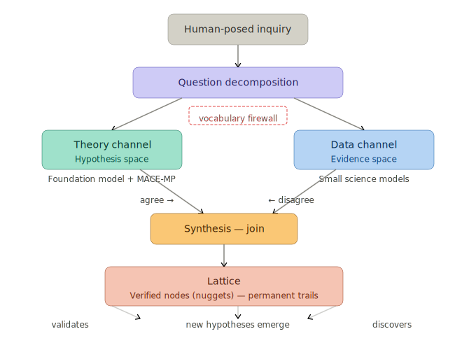

# Agentic Reasoning Lattice

A multi-agent framework that accelerates verified hypothesis discovery through structured disagreement between independent evidence channels. Agents grow a lattice of permanently addressed, dependency-tracked, verified claims — replacing ad-hoc knowledge with verified principles traceable to their foundations.

## What it produces

The framework has produced a verified, domain-independent mathematical foundation through its own operation: sequence arithmetic, interval algebra, correspondence decomposition, and displacement theory — with machine-checked proofs at the foundation and bounded model checking across the lattice.

A reasoning lattice is a set of reasoning documents with explicit dependencies between them. Each document covers one topic, declares what it depends on, and builds on verified foundations below it. The lattice grows through discovery as shared concepts are extracted into new layers. Foundation documents are formalized and verified first. Everything above builds on what's been proven.

Agents grow the lattice by creating permanent links and reasoning trails — the communication substrate builds itself through operation. Each verified node is a compact, generalizable principle — permanently addressed, dependency-tracked, and machine-verified. The lattice IS the protocol: permanent addresses, bidirectional dependencies, traceable provenance. Agents coordinate through it, not around it.

- Permanent knowledge trails — every reasoning step is addressable and retrievable
- Traceable provenance — any conclusion can be traced back through its dependency chain
- Shared reasoning — agents work from the same verified claims, not copies that drift

## How it works

A human-posed question is decomposed into channel-appropriate sub-questions. Two independent agent channels — one consulting established theory, one analyzing raw evidence — are separated by a vocabulary firewall that forces hypothesis space exploration. The theory channel cannot use data-specific terms. The data channel cannot retrieve known solutions from theoretical vocabulary. A synthesis agent integrates both into a structured reasoning document with dependency-mapped claims. Where the channels agree, principles are validated. Where they disagree, new hypotheses emerge.

Each reasoning document is decomposed into atomic claims (blueprinting — a meet operation), then verified through the adiabatic V-cycle: local scale (one claim), regional scale (a cluster of coupled claims), and full scale (the whole document), each converging before passing to the next. Mechanical verification (Dafny proofs, Alloy bounded model checking) confirms logical consistency. Every verified node is a testable prediction — the oracle traces failures back to the specific claim and evidence channel that diverged.

Out-of-scope findings flagged during review become [new inquiries](docs/patterns/scope-promotion.md), attaching to the lattice as new nodes. The system discovers the questions it should be asking, not just answers to questions posed.

The system is demonstrated on the Xanadu hypertext system — deriving formal claims from Ted Nelson's design intent (*Literary Machines*) and Roger Gregory's 1988 implementation (udanax-green) under enforced vocabulary separation. Xanadu's protocol primitives — permanent addresses, bidirectional links, traceable provenance — are what the system discovered. The methodology bootstrapped the mathematics of the protocol through its own operation.

## Applying to science

The architecture is deployment-general. The machinery — two-channel discovery, blueprinting, formalization, V-cycle review — operates on abstract inputs with domain-specific verifiers at each scale. The Xanadu case uses Dafny as the verifier for proof soundness; a scientific deployment would use experimental reproducibility.

In a science deployment, the system produces **hypotheses**, not discoveries. Verification happens externally — in a lab, through replication, or by matching against known answers for rediscovery tests. The AI's job ends at articulating claims precisely enough to be tested; reality confirms or refutes them.

See [Science Approach](docs/science/README.md) for the convergence framing, cone-as-hypothesis-cluster structure, and the Judger evaluation model.

## Documentation

- [Vision](docs/vision.md) — hypothesis space navigation, semantic communication substrate, Lamarckian evolution, building the engine
- [Methodology](docs/methodology.md) — inquiry decomposition, two-channel discovery, V-cycle review, pattern language
- [Coupling Principle](docs/principles/coupling.md) — core quality discipline. Prose and formal content are authored as a pair; the coupling is why the system can make new discoveries rather than stalling or drifting into hand-waving.
- [Discovery](docs/discovery.md) — finding formal structure through structured consultation
- [Blueprinting](docs/blueprinting.md) — meet operation: document → atomic claims
- [Formalization](docs/formalization.md) — precision as a discovery tool, reasoning that improves itself
- [Pattern Language](docs/patterns/README.md) — operationally discovered patterns for agentic reasoning systems
- [Review V-Cycle](docs/design-notes/review-v-cycle.md) — multi-scale review architecture and multigrid analogy
- [Glossary](docs/glossary.md) — system-specific terms and their definitions

### Deployments

- [Software](docs/software/README.md) — grounded deployment on legacy software reverse-engineering (Xanadu)
- [Science](docs/science/README.md) — deployment on scientific discovery (discovery stage landed on a materials lattice; downstream stages still to run)

### Guides

- [Blueprinting guide](docs/guides/blueprinting.md) — stages, YAML format, output structure
- [Formalization guide](docs/guides/formalization.md) — review steps, caching, dependency management, convergence

### Runbooks

- [Blueprinting runbook](docs/runbooks/blueprinting.md) — step-by-step execution
- [Formalization runbook](docs/runbooks/formalization.md) — step-by-step execution

## Structure

- [lattices/xanadu/discovery/notes/](lattices/xanadu/discovery/notes/) — ASN reasoning documents (discovery output)
- [lattices/xanadu/blueprinting/](lattices/xanadu/blueprinting/) — per-claim decomposition (blueprinting output)
- [lattices/xanadu/formalization/](lattices/xanadu/formalization/) — formalized claims with contracts
- [lattices/xanadu/verification/](lattices/xanadu/verification/) — Dafny proofs and Alloy models
- [lattices/xanadu/manifests/](lattices/xanadu/manifests/index.md) — per-ASN manifests, exports, dependency graphs
- [scripts/](scripts/) — pipeline automation
- [docs/](docs/README.md) — methodology, patterns, design notes, guides, runbooks