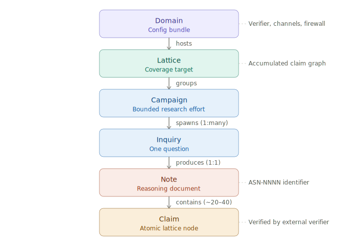
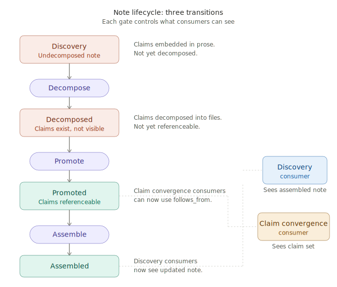

# Architecture

Reference for the system's structural architecture. The [glossary](glossary.md) has terse definitions; this document has the full picture — the six-level hierarchy, how the lattice matures, and how notes interact at different stages.

---

## The six-level hierarchy

Six structural levels, each naming a different kind of thing:



| Level | What it is | Relationship |
|---|---|---|
| **Domain** | Logical configuration: verifier binding, channel references, vocabulary firewall — expressed in `lattices/<L>/config.yaml` | Configures a lattice |
| **Lattice** | Accumulated dependency graph; one per coverage target | Groups campaigns |
| **Campaign** | Binds a theory channel and an evidence channel to a target and a bridge vocabulary | Spawns inquiries (1:many) |
| **Inquiry** | One question producing one note | Produces one note (1:1) |
| **Note** | Reasoning document grouping ~20–40 claims on one topic | Contains claims |
| **Claim** | Atomic unit of formal reasoning and verification | Terminal lattice node |

Campaigns build a lattice by spawning inquiries. Each inquiry produces one note. Notes contain claims. Claims are the atomic lattice nodes.

**Concrete examples.** The Xanadu lattice is built by campaigns pairing Nelson (theory) with Gregory (evidence). The materials lattice is built by campaigns pairing Maxwell 1867 (theory) with Dulong & Petit 1819 (evidence). Same engine, same hierarchy, different domains.

---

## Key terms

**Domain.** The logical configuration of a lattice — which verifier, which channels, which vocabulary firewall. Expressed in `lattices/<L>/config.yaml`, not as a separate directory. Two configurations that differ in any binding are two domains. The domain is what you swap to move the engine from one subject area to another.

**Lattice.** The coverage target that groups campaigns. A single configuration can host multiple lattices. Also the artifact — the accumulated dependency graph whose maturation is described below.

**Campaign.** Binds a (theory channel, evidence channel) pair to a target and a bridge vocabulary. The channel pairing is immutable per campaign — any channel change means a new campaign with a new vocabulary. Campaign identity is bound to its pairing. Ends when its question is answered (verified attachment) or abandoned (negative result). The scope-promotion pattern (out-of-scope findings becoming new inquiries) operates within a campaign. Genuinely new questions spawn new campaigns.

**Inquiry.** The 1:1 relationship with the note is definitional. Inquiry is the unit of work; note is the artifact it produces.

**Note.** A numbered, bounded, self-contained reasoning document in the Dijkstra EWD tradition. The `ASN-NNNN` identifier prefix is a legacy label retained for stable addressing; prose uses "note."

**Claim.** An assertion that can be verified, contested, or refuted. Domain-neutral across software, materials science, mathematics, and engineering. YAML type values (axiom, theorem, lemma, corollary) classify claims by logical role and are already domain-neutral.

**Channel.** A self-contained plugin holding source content, consultation code, consultation prompts, and metadata. Channels are named identities in a flat top-level namespace. Campaigns reference them by name. Each channel exposes a two-function interface: `generate_questions` (decompose an inquiry into channel-appropriate sub-questions) and `consult` (answer a single question from the channel's corpus). Internal implementation is the channel's business — flat-corpus single invocation, multi-section template assembly, KB-plus-code parallel with tool access, whatever fits.

**Bridge vocabulary.** The unified terms that make a campaign's two channels speak coherently. Curated at campaign creation time, not emergent. Vocabulary is campaign-level because it bridges two specific channels — different pairings produce different bridges. The primary consumer is the reviewer, who must interpret claims against both channels' terminology.

---

## Directory layout

```
scripts/              # protocol engine (domain-neutral)
channels/             # channel plugins (flat namespace, cross-lattice)
prompts/
├── shared/           # shared protocol prompts
├── xanadu/           # lattice-specific overrides
└── materials/        # lattice-specific overrides
lattices/
├── xanadu/
│   ├── config.yaml   # domain config: default campaign, verifier, firewall
│   ├── _docuverse/       # substrate: links + documents (protocol state)
│   ├── campaigns/    # campaign configs + bridge vocabularies
│   ├── discovery/         # notes, consultations
│   ├── claim-derivation/  # intermediate decomposition output
│   ├── claim-convergence/ # per-claim files, review history
│   └── verification/
└── materials/
    └── ...           # same structure
docs/
```

Four top-level directories, each with one job. `scripts/` is engine code. `channels/` is source-material plugins. `prompts/` is prompt templates outside agent browse paths. `lattices/` is pure accumulated state — campaigns, notes, claim files, their review history, and the substrate that holds protocol state. No prompts, no channels, no code inside the lattice.

Channels and prompts live outside lattices to prevent agent browsing — an agent working in `lattices/xanadu/` cannot find its own review prompt or another channel's source material.

---

## The lattice lifecycle

The lattice is one structure that matures from coarse-grained to fine-grained as its notes progress through the [maturation protocol](protocols/maturation-protocol.md). Three explicit operations gate that maturation.



### The three transitions

**Decompose.** Decomposes the note's claims into individual per-claim files. The claims already exist in the note's prose; claim derivation gives each one its own file. This is a [representation change](patterns/representation-change.md) that introduces structural invariants specified in the [Claim Document Contract](design-notes/claim-document-contract.md) — one body per file, filename matches label, references resolve, metadata agrees with content, no dependency cycles. The claims are not yet referenceable by other notes. The note's internal structure is taking shape; its external surface hasn't changed.

**Promote.** Makes the note's claim set available to claim-convergence-stage consumers. From this point, any note in claim convergence can reference individual claims in this note via `follows_from`. This is the gate that enables downstream convergence.

**Assemble.** Packages the converged claims back into the note form. From this point, discovery-stage consumers see the updated note. This is the gate that refreshes the note-level surface.

### The visibility rule

Which granularity a consuming note sees depends on the consumer's stage:

**Consumer in discovery** (e.g., ASN-0040 depends on ASN-0034): sees ASN-0034 as an assembled note. Claim-level changes inside ASN-0034 are invisible until assemble is called. The note boundary is an opaque interface.

**Consumer in claim convergence** (e.g., ASN-0036 depends on ASN-0034): sees ASN-0034's promoted claim set directly. Claims in ASN-0036 reference specific claims in ASN-0034 by label. The note boundary is transparent.

### Ripple behavior

Changes to a dependency's claims ripple differently depending on the consumer's stage:

**Claim-convergence-stage consumers** see changes after the dependency's decomposition is promoted. Ripple at claim granularity, gated by promote.

**Discovery-stage consumers** see changes after the dependency is reassembled into note form. Ripple at note granularity, gated by assemble.

Nothing ripples automatically. Both transitions are explicit operations.

### Convergence order

A note's dependencies must be promoted before the note itself can converge against them — you cannot write `follows_from` edges into claims that don't exist yet. The lattice matures bottom-up through the dependency graph: foundations promote first, then the notes that depend on them enter claim convergence.

### Two levels of dependency

Both are real and operational, serving different stages:

**Note-level** (`depends: [ASN-NNNN]` in YAML): declared during discovery. Coarse-grained. Tells the system which notes relate to which and determines what gets loaded as foundation context.

**Claim-level** (`follows_from: [<claim-ref>]` per claim): declared during claim convergence. Fine-grained. These are the edges that get formally verified and constitute the authoritative dependency structure. In protocol terms, these are `citation` links in the substrate.

### The terminal state

When every note's claims have converged, every dependency is claim-to-claim. Note groupings persist as provenance metadata ("these 34 claims originated in ASN-0034") but carry no dependency weight. The terminal lattice is a pure claim graph.

Notes do not retire at a single moment. They retire gradually as their discovery-stage consumers enter claim convergence. The last note boundary dissolves when the last consumer converges.

---

## The protocol architecture

The system is a set of protocols sharing a substrate. The [maturation protocol](protocols/maturation-protocol.md) governs transitions between stage protocols. Each stage protocol has a convergence criterion. Content doesn't flow through stages — it sits in the substrate and the governing protocol changes when transition conditions are met.

**Discovery → Claim Derivation → Claim Convergence → Verification.**

Each stage operates on the same content in a progressively more precise representation. Five protocols are formally specified:

- The [consultation protocol](protocols/consultation-protocol.md) produces the initial note from a campaign-bound inquiry. Two channels consulted under enforced vocabulary separation; output synthesized into a note. One-shot.
- The [note convergence protocol](protocols/note-convergence-protocol.md) drives notes toward stability during discovery. Findings classified as `comment.revise` or `comment.out-of-scope`. OUT_OF_SCOPE signals feed lattice operations in the maturation protocol.
- The [claim derivation module](modules/claim-derivation-module.md) decomposes a converged note into per-claim file pairs satisfying the [Claim Document Contract](design-notes/claim-document-contract.md). One-shot.
- The [claim convergence protocol](protocols/claim-convergence-protocol.md) drives claims toward formal precision after claim derivation. Findings classified as `comment.revise` or `comment.observe`. OBSERVE is the off-ramp for the [production drive](design-notes/production-drive.md).

Both convergence protocols specialize the [convergence protocol](protocols/convergence-protocol.md) — a document-type-neutral module providing the shared predicate, link types, and properties. "Verification" refers exclusively to the external-verifier stage (Dafny/Alloy in software; experimental replication in science).

Before each review cycle within claim convergence, a structural validation pass runs: the mechanical validator checks the [Claim Document Contract](design-notes/claim-document-contract.md), and per-invariant fix recipes resolve any violations. This is the [validate-before-review](patterns/validate-before-review.md) pattern enforcing the [Validation Principle](principles/validation.md) — structural integrity as a precondition for meaningful review.

Three principles form the quality boundary for the review cycle: [Coupling](principles/coupling.md) (content balance within files), [Validation](principles/validation.md) (structural integrity across files), [Voice](principles/voice.md) (output quality through positive style structure). See the [principles README](principles/README.md).

---