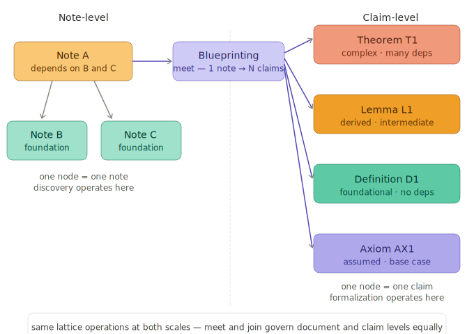

# Claim Derivation

> "The people in charge of the development of large and complex systems should adopt a point of view shared by all mature engineering disciplines, namely that of using an artifact to reason about their future system during its construction." — Jean-Raymond Abrial, *Modeling in Event-B*

## The case for an intermediate representation

A note from discovery contains the right claims, but they're embedded in narrative prose — definitions interleaved with proofs, motivating examples alongside formal statements, architectural commentary woven through derivations. The note is produced by synthesis — the join of theory and evidence channel outputs from an inquiry. That narrative is how humans reason. But you cannot formalize narrative. You can only formalize the formal claims within it.

At some point, the narrative and the formal content must be separated. The formal claims need to stand on their own — each with a clear statement, explicit dependencies, and a classification that tells the [claim convergence protocol](protocols/claim-convergence-protocol.md) how to treat it. The narrative stays as context for human reviewers. This separation is what claim derivation produces.

## What claim derivation produces

A monolithic note becomes a set of per-claim file pairs. Each claim gets two files: a YAML file carrying metadata (label, name, type, dependencies, vocabulary) and a markdown file carrying the body (statement, justification, proof).

This is a [representation change](patterns/representation-change.md) — the content stays the same but the form changes from narrative to structured per-claim files. The change introduces structural invariants that only become meaningful at this boundary: one body per file, filename matches label, references resolve, metadata agrees with content, no dependency cycles. These invariants are specified in the [Claim Document Contract](design-notes/claim-document-contract.md).

The metadata makes the formal structure explicit: what this claim is, what it depends on, what notation it introduces. The body preserves the interleaved narrative and formal content because claim convergence's reviewers need the narrative to understand the proof. Full separation comes later, at verification, when only the formal contracts enter mechanical checking.

The metadata at decomposition time is deliberately incomplete. Type classifications are best-effort, dependencies are extracted from prose but may be imprecise, vocabulary attribution has minor errors. Claim convergence tightens all of it. But structural invariants must hold from the start — the semantic content can be imprecise while the structural form must be valid. This is the distinction the [Validation Principle](principles/validation.md) draws: structural integrity is a precondition for meaningful review, not a thing review checks.

This is the meet operation at the note scale — a single node at the note-level becomes many nodes at the claim-level, each with explicit dependencies. Claim derivation is where the two granularities of the lattice diverge.

## The contract at the boundary

Claim derivation is the transition most vulnerable to [Uncontracted Representation Change](equilibrium/uncontracted-representation-change.md). The unit of encapsulation changes shape — one file becomes many — and every invariant that makes the per-claim form meaningful comes into existence at this moment. If the transition doesn't enforce them, downstream review operates on malformed state, and the claim convergence protocol spends its cycles on structural violations that no agent can name.

The [Claim Document Contract](design-notes/claim-document-contract.md) specifies what well-formed output looks like. A post-decomposition validation pass checks the contract mechanically. This same validator runs again before each claim convergence review cycle — the [validate-before-review](patterns/validate-before-review.md) pattern — ensuring that structural soundness is maintained through the review/revise cycles that follow.

## Decomposition as progressive refinement

The [claim derivation module](modules/claim-derivation-module.md) works in layers, each adding detail the previous layer could not see.

First, a mechanical split on section headers. No judgment — just string splitting. This produces sections of manageable size, each isolable. The split is mechanical because section boundaries are reliable markdown structure — burning an LLM call on what string splitting already solves would add cost and non-determinism for zero gain.

Then, per-section analysis identifies the claims within each section. Each section is read with full context to make structural decisions: this bold header is a case split inside a proof, not a new claim. These two definitions share a preamble but are logically independent. This "axiom" has a proof — it's really a design requirement whose consequences are derived.

Then, per-claim classification and dependency extraction. Each claim is analyzed independently through three focused LLM passes — type classification, dependency extraction, and vocabulary extraction. Three passes rather than one comprehensive prompt because focused prompts produce more reliable output, and parallel execution reduces wall-clock cost.

Each layer refines what the previous produced. The section split doesn't know about claims. The claim identification doesn't know about types. The classification doesn't know about vocabulary. Progressive refinement, not a single pass.

## Claim types across domains

The claim classifications — axiom, definition, design requirement, lemma, theorem, corollary — are domain-independent. What changes across domains is what fills each type, not the type itself. The claim convergence protocol treats each type the same way regardless of domain: axioms are accepted, definitions are named, theorems are proven.

| Type | Software specification | Materials science | Legal reasoning | Clinical |
|------|----------------------|-------------------|-----------------|----------|
| **Axiom** | system guarantees | conservation laws, symmetry rules | statutory definitions | diagnostic criteria |
| **Definition** | formal definitions | operational terms (band gap, conductivity) | case law interpretations | condition classifications |
| **Design requirement** | architectural constraints | measurement constraints | jurisdictional constraints | treatment constraints |
| **Lemma** | intermediate results | intermediate empirical relationships | precedent chains | clinical relationships |
| **Theorem** | proven claims | discovered principles (Wiedemann-Franz) | novel legal conclusions | treatment protocols |
| **Corollary** | immediate consequences | derivative predictions | derived obligations | derived recommendations |

The vocabulary firewall operates on domain vocabulary — theory channel terms vs evidence channel terms differ by domain, but the firewall mechanism is identical. Claim derivation classifies what the channels produce. Claim convergence verifies it. The lattice organizes it.

## The note as artifact

Discovery produces notes — Dijkstra-style prose with embedded claims. Claim derivation transforms them into structured per-claim files. Claim convergence refines those files into precise contracts. Verification translates the contracts into mechanically verifiable code.

At each stage, the same system claims are represented with increasing precision. The content doesn't change. The representation does. A claim that discovery expressed as "content once stored is never modified" becomes a classified design-requirement with label S0, explicit dependencies, and eventually a formal contract with preconditions and postconditions that a theorem prover can verify. A claim that discovery expressed as "heat capacity per atom is approximately species-independent" becomes a classified empirical regularity with label P.atomic_heat_regularity, explicit regime conditions, and a formal statement distinguishing what the theory derives from what it registers as evidence.

The note is frozen once it enters decomposition. It served its purpose. The reasoning is done, the claims are found. From this point forward, the per-claim files are the working copy. This is deliberate: the note is the record of discovery. Modifying it during claim convergence would mix two concerns: finding claims and verifying them.

## Why structural issues are expected

Discovery agents reason to understand, not to verify. They name claims inconsistently, embed definitions inside proofs, derive intermediate results that other claims need but never formally declare. A claim might be labeled "axiom" in one sentence and proven from other claims in the next paragraph. Two definitions might share a section because the author was thinking about them together, even though they're logically independent.

These are not bugs. They're the natural result of writing to understand rather than writing to verify. Claim derivation exists because the discovery process is messy and downstream review needs clean inputs. The [Claim Document Contract](design-notes/claim-document-contract.md) names what "clean" means — not perfect semantic content, but structurally valid form that claim convergence can operate on.

## Related

- [Claim Derivation Module](modules/claim-derivation-module.md) — the formal protocol specification with safety/liveness properties, algorithm, and correctness arguments.
- [Claim Document Contract](design-notes/claim-document-contract.md) — the structural contract the output must satisfy.
- [Claim Convergence](claim-convergence.md) — the next stage: driving claims to formal precision.
- [Discovery](discovery.md) — the previous stage: producing the notes that enter decomposition.
- [Representation Change](patterns/representation-change.md) — claim derivation is the canonical instance.
- [Uncontracted Representation Change](equilibrium/uncontracted-representation-change.md) — the failure mode the structural contract addresses.
- [Validate Before Review](patterns/validate-before-review.md) — structural validation reused downstream by claim convergence.
- [The Validation Principle](principles/validation.md) — structural integrity as a precondition for meaningful review.