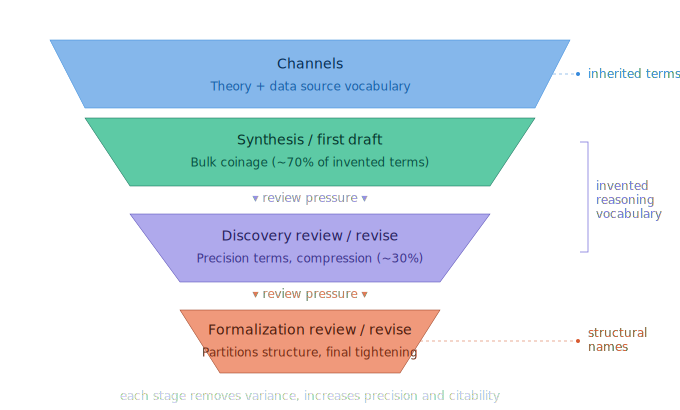

# Domain Language Emergence

*Design note. How the vocabulary produced by [prose coinage](../patterns/prose-coinage.md) is structured and narrowed as it moves through the pipeline.*

## Overview

[Prose Coinage](../patterns/prose-coinage.md) is the atomic event: one agent, one moment, one new word. This note takes the aggregate view — what the collection of those events looks like across an ASN's lifecycle. The mechanics and the per-ASN numbers (the 70/30 split, the `subspace` case) live in the pattern. What's here is the systemic picture: how vocabulary is progressively narrowed through the pipeline, what layers it sits in, and what structural shape the invented layer takes.

## Progressive narrowing

The vocabulary an ASN ends up with is the product of a funnel. Each stage removes variance and leaves a more precise, more citable, more manipulable set of terms:

1. **Channels (widest).** The theory channel and data channel each pull in terms from their source material — design documents, literature, source code, observed data. This is the raw, unfiltered vocabulary available to the ASN.
2. **Synthesis / first draft (first narrowing).** Synthesis reconciles the two channels into a single reasoning document, coining new prose where no existing term fits. The bulk of coinage happens here — roughly 70% of an ASN's invented vocabulary appears in the first draft.
3. **Discovery review/revise (second narrowing).** Review/revise cycles press on ad-hoc prose — coining more terms, compressing recurring prose concepts to symbols ([prose compression](../patterns/prose-compression.md)), or pulling upstream terms in to replace local phrasings. Roughly 30% of discovery-stage coinage happens here, typically the precision-critical terms that first-draft synthesis glossed over.
4. **Formalization review/revise (third narrowing).** Formalization cycles continue compression where needed, split sprawling contracts into dedicated properties ([accretion](../patterns/accretion.md)), and coin structural names for previously-implicit concepts. The distinctive work at this stage is structural partitioning and final tightening — producing a set of terms and symbols that can participate in proofs and mechanical verification.

Each narrowing is driven by review pressure. Nothing in this pipeline selects vocabulary for compactness on its own; terms survive because a reviewer judged them worth keeping and a reviser committed to them. The funnel is a side effect of iterative precision pressure, not a design goal.

## Three layers of named content

Not all named content in the system comes from coinage. Three layers coexist:

- **Theory-channel vocabulary.** Terms inherited from the theory channel's source material — design documents, domain models, published literature. The system uses these unchanged; they are not invented.
- **Invented reasoning vocabulary.** Prose names and operator symbols the system coins to make claims precise enough for formal reasoning. This is the layer [prose coinage](../patterns/prose-coinage.md) and [prose compression](../patterns/prose-compression.md) produce. See [channel asymmetry](../patterns/channel-asymmetry.md) for why this layer takes the shape it does.
- **Formalization-level vocabulary.** Named sub-axioms created during formalization to enable per-step citations. These are structural partitions of existing concepts, not new domain concepts.

This note is about how the second layer behaves across ASNs.

## Implications

**Hold ASNs in discovery longer than feels necessary.** Most concept invention happens in discovery; formalization adds further narrowing and occasional structural coinage but operates on what discovery produced. Short discovery periods mean incomplete vocabulary that formalization has to work around.

**Vocabulary convergence is a readiness signal.** When new discovery review/revise cycles stop producing new terms, the ASN is done inventing. That's when discovery has produced enough language to support formalization.

**The system produces externalized knowledge.** Every term coined is in natural language, named, and addressable. Concepts don't live in agent latent space; they live in the lattice as first-class citable entities. This is an architectural bias — the system trades the richness of unnamed meaning for the cumulative knowledge benefits of naming.

## Origin

Observed on the Xanadu demonstration. Examples of each layer:

- **Theory-channel vocabulary.** Nelson's *Literary Machines* vocabulary: tumbler, span, node field, user field, document field, element field, transclusion, attribution.
- **Invented reasoning vocabulary.** From ASN-0034: `⊕`, `⊖`, `inc(t, k)`, `shift(v, n)`, `δ(n, m)`, `sig(t)`, `zeros(t)`, `action point`, `displacement`, `divergence`, `zpd`. None existed in either source in that form.
- **Formalization-level vocabulary.** From ASN-0034 after T0 was split: `NAT-closure`, `NAT-order`, `NAT-discrete`, `NAT-wellorder`. Each is a structural partition of the underlying ℕ concept, introduced to enable per-step citations in proofs.

## Related

- [Prose Coinage](../patterns/prose-coinage.md) — the atomic event; contains the 70/30 finding and the `subspace` case study
- [Prose Compression](../patterns/prose-compression.md) — what happens to coined prose names when formal manipulation demands symbols
- [Channel Asymmetry](../patterns/channel-asymmetry.md) — pattern; why shape-mismatch between channels forces coinage
- [Review V-Cycle](review-v-cycle.md) — the review/revise cycles that drive each narrowing stage
