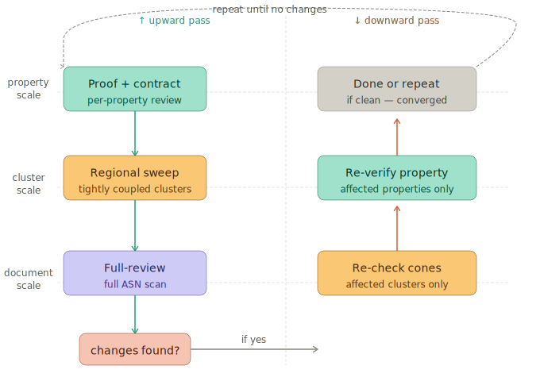
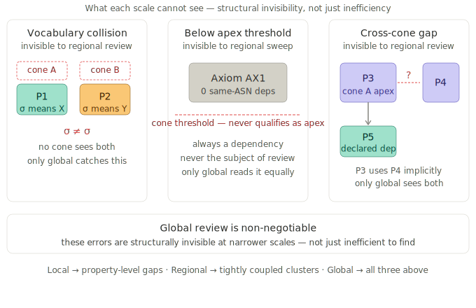

# Review V-Cycle

*Design note. See [Formalization Guide](../guides/formalization.md) for the practical pipeline reference.*

## Overview

Iterative formal verification at a single scale stalls when properties are tightly coupled. Local review (one property at a time) converges fast on independent properties but can't resolve cross-property consistency. Full review (full ASN scan) can find cross-property issues but wastes attention on noise and converges slowly. Neither scale alone is efficient across the full range of verification problems.

The Review V-Cycle addresses this by cycling through three scales of review, each handling the error class it's efficient at. The architecture is inspired by multigrid methods in numerical analysis (Brandt 1977), where multi-scale cycling converges faster than single-scale iteration by matching the solver to the error structure.

## Scales

**Local** — formalize, local-review, contract-review. One property at a time, dependencies as fixed context. Fast convergence on property-level issues: logical gaps, missing cases, contract mismatches. Cannot see cross-property consistency problems.

**Regional** — regional-sweep. Reviews dependency cones: properties with many same-ASN dependencies, processed bottom-up in topological order. Narrowed context (apex + dependencies + relevant foundation only) focuses attention on the constraint system. Catches issues that span tightly coupled clusters — the [dependency cone](../patterns/dependency-cone.md) pattern.

**Full** — full-review. Full ASN scan with complete foundation context. Finds issues invisible at narrower scales: carrier-set conflation, precondition chain gaps across unrelated properties, scope mismatches between proof and narrative. Broadest view, noisiest context, slowest convergence.

## Cycle Structure



Each pass follows an upward-then-downward path:

```
── Upward ──
  1. formalize         local     produce formal contracts
  2. local-review      local     fix proofs
  3. contract-review   local     fix contracts
  4. regional-sweep    regional  fix clusters (bottom-up DAG walk)
  5. full-review       global    broad scan

── Downward ──
  6. regional-review   regional  re-check cones affected by upward changes
  7. local-review      local     re-check properties affected by steps 5-6
  8. contract-review   local     re-check contracts affected by steps 5-7
```

The upward pass builds confidence — each scale inherits a cleaner state from the one below it. The downward pass verifies — corrections from wider scales are checked at narrower scales with higher precision.

**Convergence**: when no scale changes anything in a full pass — local, regional, and global all agree that the ASN is clean.

## Why Multi-Scale Works

Each scale is efficient at a different class of verification problem:

- A missing case in a proof is caught instantly by local review but is invisible to global (buried in noise).
- A dependency cone where one property can't reconcile its many dependencies is invisible to local (each property looks correct in isolation) but caught by regional.
- A scope mismatch between a proof and its narrative claim is invisible to regional (not in any cone) but caught by global.

Single-scale iteration wastes cycles: local grinds on issues it can't resolve, global scans dozens of properties to find one issue. Multi-scale cycling routes each problem to the scale that can handle it efficiently.

## Structural Coverage: What Each Scale Can and Cannot See



Beyond efficiency, the scales have different *structural coverage*. Some errors are not just inefficient to find at narrower scales — they are invisible. Full review is non-negotiable because of what the narrower scales cannot reach:

**Vocabulary collisions between distant clusters.** When a symbol is used with one meaning in one cluster and a different meaning in another, regional review cannot see the conflict. Each cone narrows context to its apex and dependencies; distant collisions fall outside every cone's window. Only full-ASN context reveals the overlap.

**Issues in properties below the cone-apex threshold.** The regional sweep runs on properties with at least a threshold number of same-ASN dependencies. Small properties — definitions, axioms, single-claim auxiliaries — never qualify as cone apexes. They appear only as dependencies in someone else's cone, where the reviewer's attention is on the apex. Issues internal to these properties (unsound claims, missing axiomatic support, silent assumptions) are structurally invisible to regional sweep. Full review reads every property with equal weight.

**Cross-cone gaps in dependency declarations.** A property's YAML `depends` list is a local concern, but its correctness depends on usage across the whole ASN. A missing dependency is visible within a cone only if the dependent and the depended-upon are both in it. For dependencies that span cones, only the full-ASN view catches the omission.

These are not efficiency arguments. They describe what each scale is architecturally positioned to detect. The V-cycle's value is not just faster convergence — it is complete coverage that no single scale provides.

## Relationship to Multigrid Methods

The Review V-Cycle adapts the multigrid V-cycle from numerical analysis. In multigrid, iterative relaxation on a fine grid eliminates high-frequency errors quickly but stalls on low-frequency (smooth) errors. Projecting the residual to a coarser grid makes the smooth error oscillatory and therefore easy to fix. Cycling between grid levels converges in O(N) operations — optimal.

The analogy:

| Multigrid | Review V-Cycle |
|-----------|------|
| Fine grid relaxation | Local scale (local-review, contract-review) |
| Medium grid | Regional scale (regional-sweep) |
| Coarse grid | Full scale (full-review) |
| High-frequency error | Property-level issues (local inconsistencies) |
| Low-frequency error | Cross-property patterns (dependency cones) |
| Restriction | Assembling wider context |
| Prolongation | Propagating corrections to affected properties |

The V-cycle differs from classical multigrid in two ways. First, each scale runs to internal convergence before passing to the next (cascadic behavior), rather than doing a few sweeps and restricting the residual. Second, the restriction is implicit — wider context reveals what narrower context can't see, rather than an explicit residual projection. The downward verification pass is this cycle's addition — classical cascadic multigrid has no downward pass.

## The V-Cycle as Self-Evaluation

Full-review findings that appear to be cone-level issues are diagnostic signals — evidence that regional sweep did not genuinely converge, only stopped. A clean full-review is not just completion; it is evidence that lower scales reached genuine ground state. This makes the V-cycle self-evaluating: the system assesses the quality of its own lower-scale processes through the pattern of what higher scales find.

There is no noise in a truly converged system. What looks like noise at full-review is a signal that a lower scale is incomplete. The pattern of findings tells you where the incompleteness lives:

- **Full-review finds a vocabulary collision** → genuine structural issue, regional sweep is architecturally unable to see it
- **Full-review finds something that looks like a cone-level issue** → regional sweep did not converge, go back. See [Contract Sprawl](../equilibrium/contract-sprawl.md) for a specific failure mode that produces this signal.
- **Full-review finds nothing** → lower scales reached genuine ground state, convergence is real

This self-evaluation property is what makes the V-cycle a protocol substrate rather than just a verification procedure. A system that can detect incomplete convergence in its own processes can improve those processes — adjusting scope, reconfiguring cone boundaries, reallocating agent computation. The pattern language systematically reduces wasted computation by routing problems to the scale that can resolve them. The V-cycle's self-diagnostic signal is what makes that routing improvable over time.

This connects directly to the adiabatic property of the protocol. Each scale's convergence is a genuine precondition for the next scale's findings being trustworthy — not just an ordering constraint. Running full-review on a partially-converged system doesn't produce faster results; it produces misleading ones. The adiabatic ordering is what separates genuine structural findings from artifacts of incomplete lower-scale processing.

## Detection of Scale-Appropriate Problems

The cycle includes a mechanical detection mechanism for regional-scale problems. The [dependency cone](../patterns/dependency-cone.md) pattern identifies properties that keep getting revised while their dependencies are stable — a signal that local review is stalling on a tightly coupled cluster. Cone detection uses git revision frequency and YAML dependency metadata, with no LLM involvement.

## Origin

Developed during formalization of ASN-0036 on the Xanadu project (Strand Model, 31 properties). The flat review cycle (proof → contract → cross, repeat) ran 65+ reviews without converging on tightly coupled properties around S8 (FiniteCorrespondenceRunDecomposition). Analysis of git revision history revealed the [dependency cone](../patterns/dependency-cone.md) pattern. The cone mechanism reduced review context by 58% and produced higher-quality findings. Generalizing from reactive cone detection to proactive multi-scale cycling produced the Review V-Cycle architecture.