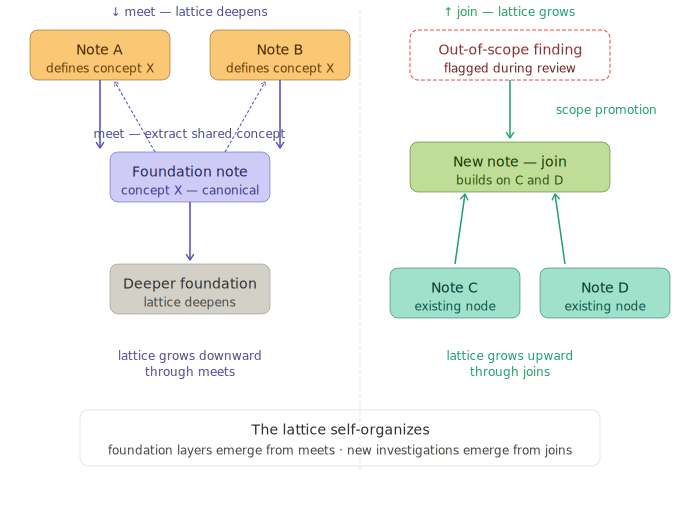

# Discovery

A human poses a question. Discovery investigates it through two independent agent channels separated by a vocabulary firewall, producing a lattice of verified claims.

## The campaign

A campaign binds a theory channel and an evidence channel to a target and a bridge vocabulary. The campaign is the unit of coordinated investigation — a sustained effort of inquiries against a specific pairing of sources. "Rediscover the atomic-heat regularity via Maxwell's dynamical theory." "Formalize the Xanadu hypertext protocol from Nelson's design intent and Gregory's implementation."

A campaign begins with a question — broad enough to be interesting, specific enough to be tractable. The question is the entry point. Everything that follows grows from it. One lattice may host multiple campaigns: the same theory against different evidence corpora, competing theories against the same evidence, or entirely new pairings. Each campaign produces notes into the shared lattice; notes from different campaigns can cite each other's foundations.

## The two channels

The theory channel consults established domain knowledge — literature, models, known principles. The evidence channel analyzes raw evidence — measurements, source code, experimental outputs. A vocabulary firewall prevents each from using the other's terms. The evidence channel reasons from evidence alone. It cannot retrieve known solutions from theoretical vocabulary — it can only report patterns it observes. This forces hypothesis space exploration rather than retrieval.

The two channels receive different context at question-generation time, and the asymmetry is intentional.

**Theory generators see a vocabulary list.** The generator's prompt includes a short, stable list of the theoretical framework's own terms — not modern terminology, not the field's general vocabulary, but the specific words the corpus uses. Maxwell's corpus gets "vis viva, elastic collision, equilibrium, β" — not "degrees of freedom, equipartition, statistical mechanics." Nelson's design gets "content, identity, permanence, links, documents, sharing, versions" — not "I-addresses, spanfilade, enfilade." The vocabulary list bounds the generator's imagination without overwhelming it. Theory space is conceptual and listable.

**Evidence generators see the corpus.** The generator's prompt includes the evidence corpus itself (or a curated synthesis when the corpus is too large). The generator sees the specific substances, measurements, code structures, or artifacts the evidence contains. Without this visibility, evidence questions default to generic retrieval — "what does the corpus report about X?" — because the generator has to imagine what might be there rather than seeing what is there. With corpus visibility, questions target specific content bearing on the inquiry. Evidence space is specific and must be seen.

The theory vocabulary list must use the corpus's own language. If the list contains modern terms the corpus doesn't use, the generator produces questions the corpus can't answer. The evidence corpus must not leak specific values or named patterns into the questions themselves — the answers extract values, the questions do not pre-state them.

## Decomposition and consultation

Each inquiry is decomposed into channel-appropriate sub-questions. Theory questions ask what the theoretical framework predicts, requires, or commits to about the inquiry's subject. Evidence questions ask what the empirical record shows bearing on the inquiry. Neither channel sees the other's sub-questions.

The question count per channel is not forced to be symmetric. An inquiry that has more to ask one channel than the other should ask more of that channel. Forced symmetry produces triplicates on the side with less to say.

Each channel answers its own questions from its own corpus. The theory answerer stays inside the theory corpus — it does not invoke results or theories beyond what the corpus contains, and it says so explicitly when a question reaches beyond the corpus's scope. The evidence answerer reports what the data shows — numerical values, units, conditions, citations — and does not theorize about why. Channel discipline is the foundation the synthesis step depends on.

A synthesis agent reads all answers from both channels and writes a structured note with dependency-mapped claims. The synthesis is the first place both perspectives meet. Where the channels agree, principles are validated. Where they disagree, new hypotheses emerge. The disagreements are where discovery happens.

## The Dijkstra voice

Discovery notes are written in Dijkstra's actual EWD style: prose with embedded formalism. Every formal statement is justified in the sentence that introduces it. The reasoning is the specification. Named invariants, frame conditions, calculational chains, weakest preconditions — the full notation system serves the argument.

The voice is not a stylistic choice. It is the [Voice Principle](principles/voice.md) in its original form — positive style structure that constrains output to load-bearing prose by construction. Discovery ran under this voice from its first prompt and it worked. Notes converged. Prose stayed coupled to formal content. The voice was the discipline before the discipline had a name.

## Review and revision

Discovery notes go through review/revise cycles. The reviewer reads as Dijkstra — with respect for the effort and no tolerance for hand-waving. Each derivation must walk its cases. Each postulate must be honestly labeled. Each regime condition must be stated where it is load-bearing.

During review, findings are classified. Correctness issues — wrong claims, missing derivations, smuggled postulates, unstated regime conditions — must be fixed. Tightening observations — phrasing, style, alternative framings — are logged but do not trigger revision. This prevents the review cycle from generating surface expansion through fixes that are correct but not worth their cost.

Out-of-scope findings get flagged — questions that no existing note can answer, claims that belong elsewhere, concepts that need their own investigation. These are candidates for new inquiries, attaching to the lattice as new nodes. This is [scope promotion](patterns/scope-promotion.md) — the system discovers the questions it should be asking, not just answers to questions posed.

## Growing the lattice

The first note from a campaign is usually too broad. That's expected. Agents identify natural boundaries — clusters of claims that reason about the same concept independently of other clusters — and split into focused notes, each covering one topic. Discovery runs on each independently.

As discovery proceeds on separate notes, patterns emerge. Two notes independently derive the same claim — both need the same comparison operation, both define the same foundational concept. When this happens, one note's claims may be natural foundations for the other. If so, it becomes a dependency — the dependent note assumes those claims rather than re-deriving them. If neither is a natural home for the shared concept, there's a missing foundation layer. Extract it into a new note that both depend on. This is the meet operation — the extracted foundation is the greatest common element below both dependent notes.

The duplication signal is itself a discovery. Two independently drafted notes converging on the same commitments means those commitments have an independent existence that neither note should own. The extracted foundation contains exactly the commitments both needed and nothing else — a stronger foundation than one designed in advance, which always contains what you thought both would need rather than what they actually did.

The lattice grows through this process. Foundation notes emerge at the bottom — discovered by noticing what keeps being re-derived across multiple notes. The lattice deepens as shared concepts are extracted into new foundation layers. New domain vocabulary emerges because the mathematics requires it, not prescribed in advance.

## Entering blueprinting

At some point the lattice has enough structure to see which notes everything else rests on. These foundations need to be put on rigorous standing — formal contracts, mechanical verification, the full weight of the V-cycle. [Blueprinting](blueprinting.md) is that transition. It can only happen bottom-up: a foundation must be solid before anything built on it can be trusted.

A note is ready to enter blueprinting when three conditions hold:

**It must be a foundation in the lattice.** You cannot blueprint a note if it depends on another note that hasn't been blueprinted and formalized yet. Work bottom-up — foundations first, then the notes that build on them.

**Discovery cycles are producing diminishing returns.** When review/revise cycles start wordsmithing — rephrasing for clarity, minor notational adjustments, few or no substantive findings — the reasoning has stabilized. If each cycle is making structural changes, the note isn't ready.

**No other note in discovery owns claims that belong here.** Before promoting to blueprinting, scan the other notes still in discovery. If any of them independently derived claims that naturally belong in this note, absorb them first.

## Origin

This methodology was developed to formalize the Xanadu hypertext system — deriving formal claims from Ted Nelson's design intent (*Literary Machines*) and Roger Gregory's 1988 implementation (udanax-green) under enforced vocabulary separation. The first test of generality was the materials science deployment: Maxwell's 1867 dynamical theory of gases paired with Dulong & Petit's 1819 specific-heat measurements. The same pipeline, same channel architecture, same review discipline — with domain-specific calibration. The methodology transferred. The calibration work was bounded.