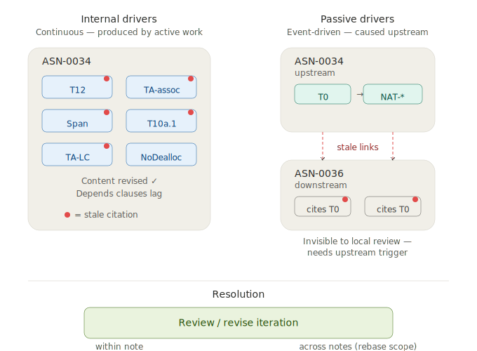

# Citation Drift

A property references a fact whose home has moved, been renamed, or never had a declared home. The reasoning is correct; the citations no longer match current structure. Accumulated across many properties, the ASN's dependency graph no longer reflects its actual reasoning — consumers of the lattice can't trace what each proof rests on.

## Cause

Citation drift has two kinds of driver. The distinction is about where the causing change happens — within the same ASN or upstream of it — not about which stage the drift appears in. Discovery and formalization both have both kinds.

### Internal drivers (continuous)

Active work inside an ASN's own review/revise cycles produces drift within that same ASN's content. Two subtypes:

**Content evolution.** During a review/revise cycle, a proof or reasoning claim picks up a new step that cites a fact. The reviser rewrites the prose but doesn't update the `depends` clause. Metadata lags content by one small step. Every review cycle can produce this, in discovery as well as formalization.

**In-ASN accretion.** When a new axiom or property is added inside the ASN to hold a fact its own reasoning needs ([Accretion](../patterns/accretion.md)), the consumers of that fact inside the same ASN don't immediately update their citations. The new home exists; the old citation pattern persists until cleanup.

Both are expected side effects of active work. The ASN is in motion. Drift accumulates as long as motion continues.

### Passive drivers (event-driven)

Changes in an upstream ASN produce drift in downstream consumers. The downstream ASN hasn't changed itself; its citations to the upstream have become stale. Three subtypes:

**Attractor splits.** When a [Genesis Attractor](contract-sprawl.md) is split — T0 into T0 + NAT-closure + NAT-order + ... — every downstream ASN that referenced the attractor carries stale citations. One upstream event produces a burst of downstream drift.

**Extractions and renames.** When an upstream ASN extracts a concept into a new property ([Extract/Absorb](../patterns/extract-absorb.md)) or renames one (PositiveTumbler → TA-Pos), downstream prose and Depends lists that referenced the old name drift.

**Upstream accretion.** When an upstream ASN adds a new property, downstream reasoning that would cite the new property for precision doesn't yet know it exists. The drift is small per event but accumulates across the downstream surface as the upstream grows.

Passive drift arrives in bursts after upstream events, then stops. Downstream ASNs do not generate passive drift on their own.

### Why the distinction matters

Internal drift is *produced* within the ASN under review and *detected* by cross-review on the same ASN. A review cycle both causes and catches its own drift. Converges in a few iterations.

Passive drift is *caused* outside the ASN and *invisible* to local review. A downstream ASN's cross-review may converge perfectly while the ASN still carries stale citations to an upstream that has moved on. Detection requires cross-ASN review or a rebase triggered by the upstream event.

## Signal

Cross-review findings of the form "property P uses X in its proof but does not list X in Depends" — or in discovery, prose references to labels, concepts, or vocabulary that no longer exist in that form upstream.

The pattern is distributed, not concentrated: Contract Sprawl concentrates on one attractor; citation drift scatters across many properties. Each finding is small. Accumulation across dozens of properties is what makes the signal visible.

### Subtype: bridge citations

A proof has steps that go X → Y. Each such step needs a rule that licenses the inference. If the rule is "X implies Y by property P," then P has to be cited — P is what makes the step valid.

A bridge is exactly this: a property P that establishes X → Y (or X ≡ Y) for two concepts in the proof. When the proof uses the inference, the dependency metadata must list P. Otherwise the proof has a step licensed by a rule that isn't declared — the conclusion follows from premises that include an uncited rule.

Missing bridge citations are citation drift at the inference-rule level.

## Example

After the T0 split on ASN-0034, two cross-review runs surfaced dozens of internally-driven findings across cycles:

- NAT-* axioms stated but not cited by 11 properties
- T12, TA-assoc, TA5-SIG, Span omit Depends clauses entirely
- T10a.1, T10a.2, T10a.3 have incomplete Depends
- PartitionMonotonicity invokes T3 without citing it
- NoDeallocation consumes AllocatedSet's vocabulary with no Depends
- TA-LC, TumblerSub, TumblerAdd missing specific NAT-* citations after NAT-sub was added during the same run

Each finding was small. The total across two runs exceeded twenty.

The same split produced passive drift in ASN-0036 — its proofs still cite T0 for ℕ facts that now live in NAT-*, and its discovery prose references labels that no longer exist in that form. That drift is invisible to ASN-0036's own cross-review unless the review also reads ASN-0034's current state.

## Resolution

Review/revise iteration at the system scale. Cross-review finds internal drift mechanically by cross-referencing proof content and Depends lists. The reviser patches the metadata one finding at a time. A few cycles converges the cleanup.

Passive drift from upstream changes requires a rebase pass — cross-ASN review or a deliberate downstream updating step triggered when the upstream event happens. A downstream ASN's own review cycles will not produce this drift on their own, but will not resolve it either unless they are told the upstream moved.

Citation drift is the expected side effect of active reorganization. Every [Contract Sprawl](contract-sprawl.md) split produces it. Every [accretion](../patterns/accretion.md) produces a small amount. The presence of drift is not a failure — it is evidence that reasoning has recently changed and metadata hasn't caught up. Cross-review (for internal drift) and cross-ASN rebase (for passive drift) are the tools that resolve it.

## Related

- [Review/Revise Iteration](../patterns/review-revise-iteration.md) — the mechanism that resolves drift. Cross-review finds each gap; the reviser patches the metadata; cycles converge.
- [Contract Sprawl](contract-sprawl.md) — a split produces a burst of passive drift in every downstream consumer of the attractor. Cleanup is required follow-up.
- [Accretion](../patterns/accretion.md) — new properties introduced as accretion produce small internal drift until downstream proofs discover the new home.
- [Verification V-Cycle](../design-notes/verification-v-cycle.md) — drift is the main thing cross-review catches. Its scattered per-property nature is precisely what narrower scales miss.