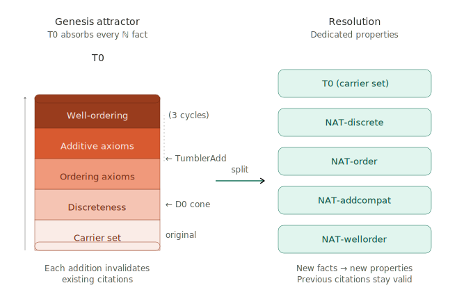

# Contract Sprawl

A claim's formal contract keeps growing across review cycles. Each new clause invalidates the completeness of every existing citation. Reviews keep finding citation gaps created by the previous cycle's extension. The contract never stops moving.

## Growth modes

Contract Sprawl has two observed modes:

**By-item growth.** The contract accumulates more clauses: more preconditions, more postconditions, more Depends entries. The list gets longer across cycles.

**By-entry growth.** Individual entries — most commonly inside Depends — stop being concise labels and become prose essays. The Depends section's word count grows even when its item count is stable. Narrative invades a structural slot.

Both modes attract review findings for the same reason: reviewers audit structural sections for completeness and consistency, and any growth creates new surface to audit.

## Forces

**Genesis Attractor.** The claim at the genesis of a concept — the first claim in the note that introduces it — becomes the default home for every fact anyone needs about that concept. Downstream reasoning has nowhere else to put new facts. Primary force behind by-item growth.

**Citation accounting in prose.** Reviewers ask "where is X used?" and revisers answer in the Depends entry itself, turning each entry into a usage essay. Primary force behind by-entry growth. Belongs in [structured metadata or dependency graphs](../patterns/lattice.md), not in prose.

**Exhaustiveness obligations.** A meta-claim of completeness ("this list is exhaustive") creates an obligation to defend completeness. Each cycle finds a gap; reviser extends the list; larger list exposes more gaps. Amplifies both modes.

## Signal

The same claim's contract grows across multiple review cycles — either the item count rises or the entries get longer. A non-converging cone whose apex's contract changes every cycle is the classic presentation.

## Example: T0 absorbing ℕ

ASN-0034's T0 (CarrierSetDefinition) started as "T = finite sequences over ℕ; ℕ with standard claims." Over three different cones and four cycles, T0's contract grew to state: additive identity, strict total order (irreflexivity, transitivity, trichotomy), discreteness, order compatibility, successor inequality, and well-ordering.

Sources:
- D0 cone added discreteness for ZPD's proof
- TumblerAdd cone added ordering axioms for T1's trichotomy
- TumblerAdd cone added additive axioms for action-point arithmetic
- TumblerAdd cone added well-ordering for T10's `min` operation

During the same period, TumblerAdd and T10a-N cones both hit cycle 8 without converging. Both had remaining findings about T0 citation completeness.

T0 was the only claim introducing ℕ. Every ℕ fact had nowhere else to go.

## Resolution

**Split the attractor into dedicated claims.** T0 becomes T0 (carrier set) plus NAT-wellorder, NAT-discrete, NAT-order, NAT-addcompat, etc. Each independently citable.

With the split, new facts about the concept are added as new claims, not as clauses to an existing one. Previous citations stay valid because no existing contract changes. Growth is by accretion instead of mutation.

**Follow the split with [review/revise iteration](../patterns/review-revise-iteration.md).** The split leaves downstream citations pointing at the old attractor for facts that moved. Review/revise realigns them.

**Prefer structural fixes over textual ones.** Many cycle findings present two resolution options — a structural fix and a textual fix. The reviser systematically picks the textual fix, which creates by-item or by-entry growth. Forcing the structural option when both exist is the general discipline against [Surface Expansion](surface-expansion.md).

## Limits of the Resolution

Splitting the attractor closes one channel — the contract itself — but the Genesis Attractor's role persists. If the slimmed claim still plays "authoritative reference for the concept," content re-accumulates in other surfaces: prose, inline enumerations, Depends entries becoming essays. The Resolution above dissolves *Contract* Sprawl specifically; it does not prevent [Prose Sprawl](prose-sprawl.md), [Index Sprawl](index-sprawl.md), or by-entry growth inside the Depends of the now-slim contract.

Complete resolution requires changing the site's *role*, not just its content. Either rewrite the claim's scope so the concept no longer has a home there, or route concept-level references to structured metadata the review cycle doesn't read.

## Related

- [Accretion](../patterns/accretion.md) — the pattern that prevents Contract Sprawl. Claims grow by adding new claims, not by mutating existing ones.
- [Prose Sprawl](prose-sprawl.md) — often emerges on the same site after Contract Sprawl is partially resolved.
- [Index Sprawl](index-sprawl.md) — the Genesis Attractor's enumerative form; a sibling failure.
- [Surface Expansion](surface-expansion.md) — the shared mechanism across Contract/Prose/Index Sprawl. Contract Sprawl is the contract-surface manifestation; monitoring lives at the Surface Expansion level.
- [Dependency cone](../patterns/dependency-cone.md) — can mask Contract Sprawl. A non-converging cone may look like coupling when the real cause is an apex sprawling each cycle.
- [Review V-Cycle](../design-notes/review-v-cycle.md) — clean full-review followed by cones finding issues often traces back to a Genesis Attractor.
