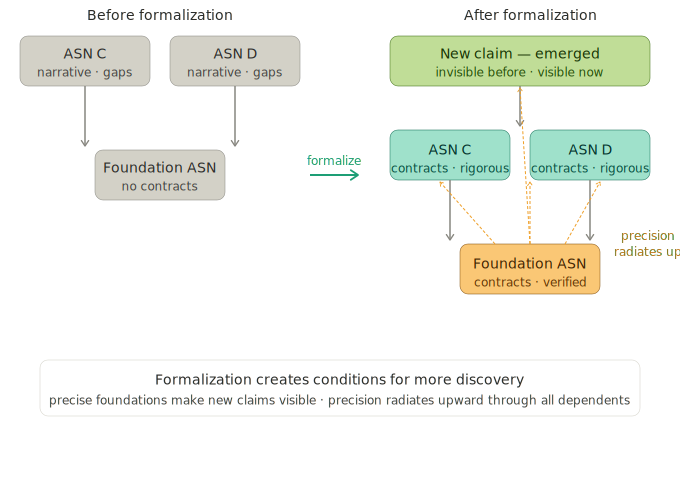

# Formalization

Discovery finds the properties of a system. Blueprinting makes them individually addressable. Formalization makes them true.

A reasoning lattice contains candidate properties, but they carry contradictions, imprecisions, and unstated assumptions. Properties that were independently reasonable turn out to conflict when forced to coexist in a single formal system. Edge cases that narrative reasoning glossed over become unavoidable when every claim must be proven exhaustively. Formalization is where this resolution happens.

## Where formalization begins

Discovery produces properties independently. Each property is reasonable in isolation. But properties must work together as a system, and that's where contradictions appear. Two properties may each be correct on their own but impose conflicting constraints on a shared concept. A definition that works for simple cases may fail when an edge case exercises it under conditions another property guarantees. Informal reasoning tolerates vagueness in precisely the places where the interesting constraints live.

These contradictions are the raw material of formalization. By demanding precision — exact preconditions, exhaustive case coverage, explicit dependencies — formalization resolves them and surfaces structure that was hidden in the vagueness.

From the demonstration domain: ASN-0034's GlobalUniqueness theorem illustrates this. Discovery stated the property simply: no two distinct allocations produce the same address. Formalization demanded an exhaustive proof and revealed that a 40-year-old addressing scheme achieves coordination-free uniqueness through structural length separation — a property its designer never articulated. The proof also showed that the allocator discipline constraint is necessary: without it, uniqueness fails. Later, [multi-scale review](design-notes/verification-v-cycle.md) found a counterexample that mechanical verification (Dafny), bounded model checking (Alloy), and 30+ single-scale review cycles all missed — the allocator axiom permitted duplicate child-spawning. The fix cascaded through the lattice and 4 dependent properties re-verified automatically.

Each contradiction resolved tightens the specification and often reveals a deeper principle that unifies what seemed like separate concerns. The resolution process is where domain-specific reasoning dissolves into general mathematics. In the demonstration domain, the content architecture's two-stream separation became an instance of correspondence decomposition; tumbler arithmetic became sequence arithmetic over ordered finite sequences. The domain terms fell away and the mathematics stood on its own. The reasoning lattice organized the work. Formalization revealed that the work was more general than the domain that motivated it.

## Reasoning that improves itself

Discovery connects — it finds properties, links them, grows the lattice outward. Formalization constructs — it builds from the bottom up, each piece locked into place before the next goes on. Each property formalized adds a piece to the structure, and that piece constrains what the remaining pieces can be. A tightened precondition in one cycle enables the next cycle's reviewer to see implications the previous version didn't have. A resolved contradiction between two properties reveals a relationship that only becomes visible once both are precise. The degrees of freedom shrink. The system takes shape.

Each cycle builds on the previous. The proof reviewer tightens a contract. The contract reviewer sees that the tightened contract now implies something new. The cross-reviewer sees a relationship between two properties that only became visible because both were strengthened in the previous cycle. The reasoning compounds — each property formalized makes the next one more precise, because the contracts it produces become the premises its dependents reason from.

## Formalization radiates through the lattice

Formalizing a foundation ASN changes everything above it. When a foundation's properties gain precise contracts — exact preconditions, exact postconditions, exact constraints — the discovery ASNs that depend on it see those contracts. Their reasoning becomes more rigorous because their premises are more rigorous. Properties that were invisible under informal foundations become visible under formal ones.

This is more than quality improvement. Discovery ASNs find new things after their foundations are formalized. In the demonstration domain, a discovery ASN derived a new property from freshly formalized foundation contracts. The data channel verified whether the property held empirically against the implementation. It did. A property that didn't exist before formalization, validated against evidence that had existed for 40 years without anyone having formalized the relationship.

Formalization doesn't just verify what discovery found. It creates the conditions for discovery to find more.