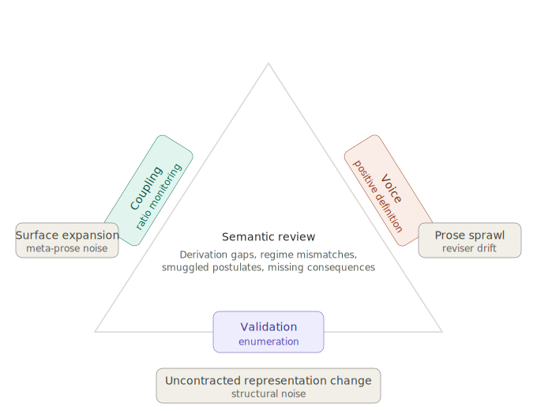

# Methodology

A human poses a question. The system decomposes it into channel-appropriate sub-questions, launches a structured multi-agent discovery process, and grows a lattice of verified knowledge. The lattice accumulates every finding, revision, and proof as permanent, addressable, dependency-tracked nodes. The methodology is one rhythm applied at every scale: narrow scope, refine through iteration, verify coherence.

The system is a set of protocols sharing a substrate. The [maturation protocol](protocols/maturation-protocol.md) governs transitions between them. Each protocol has a convergence predicate. Agents drive work within a protocol. The substrate holds shared state across all of them.

The unit of work is the note (identifier prefix `ASN-NNNN`) — a document covering one topic. Notes form a dependency lattice: each declares what it depends on and what it covers, building on verified foundations. At any point, some notes may be in discovery, others in claim convergence, others in verification. The dependency order determines which must stabilize first.

## Campaigns

A campaign binds a theory channel and an evidence channel to a target and a bridge vocabulary. The campaign is the operational unit — the thing a human launches. One lattice may host multiple campaigns: the same theory against different evidence corpora, competing theories against the same evidence, or entirely new pairings. Each campaign produces notes into the shared lattice; notes from different campaigns can cite each other's foundations.

Campaign architecture is what makes framework comparison possible. Two campaigns sharing the same evidence corpus but pairing it with different theories produce competing explanations of the same data. The lattice holds both, with explicit dependency chains showing where they agree (shared observational foundations) and where they diverge (framework-specific commitments).

## [Discovery](discovery.md)

Discovery is how new knowledge enters the lattice. The [two-channel architecture](two-channel-architecture.md) decomposes a question into independent investigations — one consulting established theory, one analyzing raw evidence — separated by a vocabulary firewall that forces hypothesis space exploration rather than retrieval. A synthesis agent integrates both channels into a structured note with dependency-mapped claims. Where the channels agree, principles are validated. Where they disagree, new hypotheses emerge.

The two channels receive different context at question-generation time. Theory generators see a vocabulary list — the stable conceptual terms of the theoretical framework. Evidence generators see the corpus itself — the specific measurements, code, or artifacts they will be asked about. This asymmetry matches the representational difference between the channels: theory space is conceptual and listable, evidence space is specific and must be seen to be questioned precisely.

The [note convergence protocol](protocols/note-convergence-protocol.md) drives the synthesized note toward stability through review/revise cycles. Findings are classified as `comment.revise` (must fix) or `comment.out-of-scope` (valid concern, belongs elsewhere). Out-of-scope findings become candidates for new inquiries through [scope promotion](patterns/scope-promotion.md) — the system discovers the questions it should be asking, not just answers to questions posed.

## [Blueprinting](blueprinting.md)

Blueprinting is the meet operation on the lattice: a note-level node becomes many claim-level nodes. A note with dozens of interleaved claims is decomposed into atomic units — one file per claim, dependencies mapped, vocabulary extracted. Each claim is classified (axiom, definition, design requirement, lemma, theorem, corollary) and gets its own statement, justification, and proof.

This decomposition is a [representation change](patterns/representation-change.md) — the content stays the same but the form changes from narrative to structured per-claim files. The representation change introduces structural invariants that must hold for the per-claim form to mean anything: one body per file, filename matches label, references resolve, metadata agrees with content, no dependency cycles. These invariants are specified in the [Claim File Contract](design-notes/claim-file-contract.md).

This decomposition is what makes claim convergence possible. Claims can be reviewed independently, grouped into clusters, or reviewed as a complete set. Without blueprinting, the claim convergence protocol has nothing to operate on.

## The Three Principles

Three design commitments form the quality boundary for the review cycle. Together they keep review focused on its actual job — finding semantic issues in the reasoning.

**[Coupling](principles/coupling.md)** — prose and formal content are authored as a pair, at an artifact-specific ratio (90/10 for notes, 70/30 for claim files). Divergence from the ratio signals decoupling — one surface growing without the other. Without coupling, review drowns in [Surface Expansion](equilibrium/surface-expansion.md).

**[Validation](principles/validation.md)** — every representation has a structural contract, and no review cycle operates on state whose contract has not been mechanically verified. A [validate-before-review](patterns/validate-before-review.md) pass runs before each review cycle, catching structural violations that would otherwise consume review cycles through add-bias. Without validation, review spends its cycles on structural noise.

**[Voice](principles/voice.md)** — LLM output is constrained by defining what well-formed output looks like (the Dijkstra voice), not by enumerating what it must avoid. Positive style structure leaves no slot for non-reasoning prose. Enumerated prohibition lists leave gaps the agent drifts through. Without voice, the reviser's add-bias produces prose sprawl that the other two principles detect but cannot prevent.

The three principles were not designed as a system. Voice was present from the beginning — the discovery prompts used Dijkstra voice from their first draft and it worked. When claim convergence began with a different voice and prescriptive rules, every failure mode appeared. Coupling and validation were articulated to manage the symptoms. Voice was rediscovered when the original discovery prompts were restored and the symptoms resolved. The three principles are complementary: coupling monitors content health, validation enforces structural health, voice shapes output quality. See the [principles README](principles/README.md) for the full account.

## [Claim Convergence](claim-convergence.md)

The [claim convergence protocol](protocols/claim-convergence-protocol.md) drives claims toward formal precision. Convergence is defined by a predicate on the link graph: every `comment.revise` targeting a claim has a matching `resolution`. The protocol defines when convergence is reached. How to get there — which scope strategy, what review order, how to assemble context — is choreography.

Before each review cycle, a structural validation pass runs: the mechanical validator checks the representation's structural contract, and per-invariant fix recipes resolve any violations. The reviewer then sees structurally sound state and can focus on semantic issues — derivation gaps, regime mismatches, smuggled postulates, missing consequences. This is the [validate-before-review](patterns/validate-before-review.md) pattern enforcing the [Validation Principle](principles/validation.md).

The reviewer classifies findings by whether they require action. Correctness issues — broken precondition chains, missing axioms, ungrounded operators — are `comment.revise` and require resolution. Tightening observations — loose phrasing, minor style — are `comment.observe` and do not trigger revision. OBSERVE is the off-ramp for the [production drive](design-notes/production-drive.md) — the LLM's tendency to generate findings and push them toward action. Without it, every observation becomes a mandatory revision and the protocol over-revises.

The reviser can close a comment in two ways: `resolution.edit` (the claim was changed to address the concern) or `resolution.reject` (the finding was refused, with a rationale document explaining why). Either way the comment is resolved. The rejection rationale is a first-class document in the link graph — addressable and reviewable.

The protocol uses two scope strategies as choreography: adaptive scope (context grows on demand as the reviewer requests missing references) and comprehensive scope (all claims loaded before review begins). Adaptive scope catches within-cone issues efficiently. Comprehensive scope catches cross-cone issues where nothing in a claim's dependency chain connects it to a relevant provider. The choreography alternates them; the protocol doesn't prescribe which runs first.

**Mechanical verification** (Dafny proofs, Alloy bounded model checking) is a validation layer downstream of claim convergence. It confirms that converged contracts are logically consistent and faithfully encoded. But claim convergence catches what mechanical verification cannot — a theorem (GlobalUniqueness) passed Dafny, Alloy, and 30+ review cycles. Review at wider scope found a counterexample in 8 cycles. Claim convergence discovers; mechanical verification validates.

## The Oracle

Each verified lattice node is a testable prediction: preconditions, postconditions, invariants, formal contract. When a prediction fails against data, the reasoning trail traces the failure back to the specific claim and evidence channel that diverged. This traceability is not instrumented after the fact — it is structural. Every dependency is explicit and permanent. Every finding has a source.

The oracle is the mechanism that makes the lattice systematically improvable. Every failure points to exactly where the reasoning needs revision. The claim convergence protocol re-verifies the affected node — the verification failure enters as a `comment.revise` — and corrections propagate upward through dependents. The lattice self-heals because the oracle identifies not just that something failed, but where and why.

## Self-Healing

When a foundation claim changes, dependents re-verify automatically through the same protocol that built them. The lattice self-heals because every dependency is explicit and tracked. A fix at the foundation propagates upward: dependent claims carry stale citations, their review cycles detect the staleness through findings traceable to the changed foundation, and they adapt. Demonstrated when the GlobalUniqueness fix cascaded through 4 dependent claims that re-verified without manual intervention.

This is a property of the lattice structure, not a feature bolted on. Permanent addresses mean claims never lose their identity. Bidirectional dependencies mean changes are visible in both directions. The convergence predicate means re-verification follows the same rhythm that produced the original verification — new `comment.revise` links are filed, and they require resolution just like the originals did.

## The Pattern Language

The patterns govern how the system operates. They were discovered through operation — each observed before it was named. The primary pattern is [narrow → refine → verify](patterns/narrow-refine-verify.md), the scientific method operationalized for agents. The remaining patterns describe what happens in practice: when review stalls ([dependency cone](patterns/dependency-cone.md)), how questions decompose ([scoped inquiry](patterns/scoped-inquiry.md)), how domain and formal language connect ([vocabulary bridge](patterns/vocabulary-bridge.md)), how the lattice grows ([scope promotion](patterns/scope-promotion.md), [extract/absorb](patterns/extract-absorb.md)), how structural validation precedes semantic review ([validate before review](patterns/validate-before-review.md)).

The patterns compose — every process in the system, at every scale, follows the same narrow → refine → verify rhythm. Discovery narrows questions to channels. Blueprinting narrows documents to claims. Claim convergence narrows review to the scope that matches the issue. The pattern language systematically reduces wasted agent computation by routing each problem to the scope that can resolve it.

See [Pattern Language for Agentic Reasoning Systems](patterns/README.md) for the full catalog.

## What the Methodology Produces

The methodology produces a lattice with algebraic structure:

- **Meet** — shared concepts extracted into new foundation layers below both consumers. Blueprinting executes meets. [Extract/absorb](patterns/extract-absorb.md) executes meets: shared definitions become foundation nodes that dependents reference.
- **Join** — new nodes created above multiple foundations. Synthesis executes joins. [Scope promotion](patterns/scope-promotion.md) executes joins: out-of-scope findings become first-class investigations connecting to existing nodes.

The lattice order — which nodes depend on which — is discovered, not imposed. Foundation layers emerge when multiple higher-level documents independently define the same concept. New domain vocabulary emerges because the mathematics requires it, not prescribed in advance.

Every review cycle, finding, and revision is a permanent artifact in the lattice with the same verified, addressable, dependency-tracked structure as the knowledge it produces. The system's operational history is part of the lattice itself.

## What Verification Proves and What It Cannot

**Contracts** are the claims — preconditions, postconditions, invariants. They say what the system guarantees.

**Proofs** are the reasoning that justifies those claims. The proofs can have gaps, and the claims can still be true. A correct contract with a flawed proof is better than no contract at all.

**The claim convergence protocol** checks that contracts are precise, internally consistent, and faithful to the derivation. It operates on text and can be wrong, but the convergence predicate ensures that every concern raised has been addressed — by edit or by reasoned rejection.

**Mechanical verification** (Dafny, Alloy) proves logical consistency. But it cannot tell you whether a postcondition describes what the system *should* do (that is a design question), whether the axioms are the right axioms (those are posited from evidence), or whether the formalized specification matches reality (that requires testing).

**Golden tests** close the final gap — running verified contracts against the real system checks whether the specification matches reality.

The chain of trust: human judgment establishes intent, the claim convergence protocol makes it precise, mechanical verification makes it consistent, testing makes it real.

## Origin

This methodology was developed to formalize the Xanadu hypertext system — a domain where design authority (Ted Nelson) and implementation evidence (Roger Gregory's udanax-green) exist but no formal specification does. What emerged from operating the system was the recognition that the lattice, the pattern language, and the protocol architecture constitute a general methodology independent of the domain being formalized.

The first test of that generality was the materials science deployment: Maxwell's 1867 dynamical theory of gases (theory channel) paired with Dulong & Petit's 1819 specific-heat measurements (evidence channel), targeting rediscovery of the atomic-heat regularity. The same engine, same protocol architecture, same review discipline — with domain-specific calibration (vocabulary lists, corpus injection, science-specific review checks for regime conditions and anachronism). ASN-0002 converged after 8 review cycles producing physically correct specification content whose open questions mapped to real subsequent research programs in physics. The architecture transferred. The calibration work was bounded.

The methodology is the generalization. Xanadu is the origin. Materials is the validation.