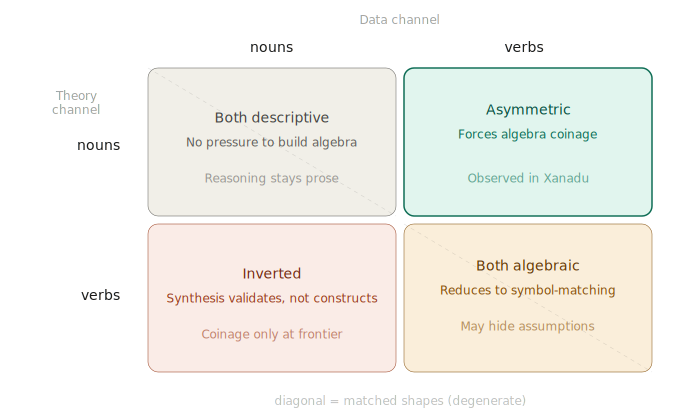

# Channel Asymmetry

## Pattern

When a Two Data Authorities setup produces useful output, the two channels arrive in incompatible representational shapes. The shape mismatch prevents naive merging, forcing synthesis to construct bridging vocabulary — which is where the system's invented reasoning terms come from.

## Forces

- **Neither channel alone produces usable formal vocabulary.** Descriptive prose names things without naming operations. Implementation code names operations but with implementation-specific packaging.
- **Formal output requires named operators.** Proofs need composable, citable vocabulary. Prose nominalizations and implementation names don't directly compose.
- **A bridging requirement creates coinage pressure.** When synthesis must reconcile two sources into formal output, and neither source supplies the needed vocabulary, coinage becomes the available response.
- **Shape mismatch makes the bridging requirement non-trivial.** If both sources had the same shape, bridging would collapse into symbol-matching. The shapes must differ for coinage to be genuine.

## Structure

**Theory-verbs × data-verbs (both algebraic).** Synthesis reduces to symbol-matching: is the theory's operator the same as the data's? Convergence is faster, but the hard step (recognizing what operations the proofs actually need) is pre-empted by the upstream choices, the inherited algebra may not fit the downstream proofs, and apparent alignment can hide incompatible assumptions that only surface when the two shapes are forced to line up.

**Theory-nouns × data-nouns (both descriptive).** Neither side names operations. Synthesis has no pressure to build an algebra — reasoning stays at the level of architectural prose, and no formal manipulation is possible because there are no named operators to manipulate.

**Theory-verbs × data-nouns (inverted).** Theory ships the algebra, data ships only observations. Synthesis becomes validation more than construction. Coinage happens only at the frontier, where observations exceed theory's named operators.

The sweet spot sits between these failure modes: **enough representational mismatch that naive merging fails, enough shared referent that bridging remains conceivable.**

## When it works

**It forces algebra construction rather than algebra copying.** When neither channel pre-names the operations, synthesis has to invent them. Invention is tightly coupled to what the downstream proofs will need — the coined operator signature reflects the reasoning requirement, not an external author's choices. The algebra that emerges is fit-to-purpose.

**Two-channel disagreement surfaces edge cases.** When the theory channel states intent gesturally and the data channel exhibits specific corner-case behavior, synthesis has to reconcile the abstract commitment with the implementation's actual behavior. If both channels pre-named the operation in the same way, apparent agreement would paper over edges that only appear when the two shapes are forced to line up.

## Applications

Observed on the Xanadu demonstration (see Origin).

Speculative extensions — not yet observed:
- [Channel Asymmetry in New-Science Domains](../science/channel-asymmetry-new-science.md) — how this pattern might apply in scientific domains where theory and data meet on a different axis (modality, abstraction level).

## Origin

Observed in the [legacy-software instantiation](two-data-authorities-legacy-software.md) of [Two Data Authorities](two-data-authorities.md) on the Xanadu demonstration. The two channels were:

- **Theory channel: Ted Nelson's *Literary Machines* and associated concept catalog.** Noun-heavy descriptive prose. The concept catalog lists ~40+ entries, all nouns (tumblers, spans, endsets, hyperfiles). Direct quotes nominalize relations: "Tumbler addressing is concerned with the management of storage," "an arithmetic could be developed."
- **Data channel: Roger Gregory's udanax-green C implementation.** Verb-present but wrapped in implementation packaging. Operations appear as function names like `tumbleradd`, `strongsub`, `weaksub`, `absadd` — each has to be un-wrapped to be cited at concept level.

Synthesis coined the bridging algebra: `⊕`, `⊖`, `inc`, `shift`, `δ`, `≼`, `zpd`. None exist in either source in that form; all were coined during synthesis.

The prompts don't cause the asymmetry. The synthesis instructions and generated questions explicitly push toward verbs, relations, and invariants. Nelson's responses come back noun-heavy regardless, because his source material is noun-heavy. The asymmetry originates in the source, not the prompting.

**A concrete example of edge-case surfacing.** Nelson's design prose asserts that "an arithmetic could be developed" — gestural, no signature, no edge cases. Gregory's `strongsub` has specific sign-case behavior (returns the minuend unchanged when exponents differ in a particular direction). Synthesis had to name the abstract operation (`⊖`) and specify its precondition in a way the implementation's behavior actually satisfies — which surfaced `a ≥ w` as a first-class feature of the abstract operator.

## Related

- [Two Data Authorities](two-data-authorities.md) — Channel Asymmetry serves this pattern by specifying how the two channels should relate
- [Prose Coinage](prose-coinage.md) — the atomic event of naming that this pattern produces pressure for
- [Domain Language Emergence](../design-notes/domain-language-emergence.md) — the aggregate view of how coined vocabulary accumulates and narrows through the pipeline
