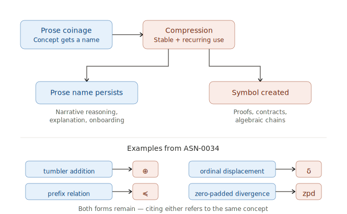

# Prose Compression

## Pattern

A concept already named in prose gets a symbol for formal manipulation. The prose name stays available for narrative reasoning; the symbol enables compact expression in proofs, contracts, and algebraic chains. The concept itself does not change — only its form.

"Tumbler addition" becomes `⊕`. "Ordinal displacement" becomes `δ`. "Prefix relation" becomes `≼`. The symbol is a compressed form of the same concept, not a new one.

**Prose compression is required for formal manipulation.** Algebraic chains, preconditions and postconditions, mechanical verification all need compact notation. Prose alone cannot support `(a ⊕ b) ⊕ c = a ⊕ (b ⊕ c)`. Every concept that will participate in formal reasoning must be compressed to a symbol at some point. Compression can happen during discovery (so formalization inherits the symbols) or during formalization itself (review cycles perform it as part of their work). Either way, the formal contracts that emerge at the end depend on compression having happened.

## Forces

- **Prose is readable but verbose.** "The prefix relation holds between p and q when p's components match q's at every position up to #p" is clear but cannot be chained through a proof.
- **Symbols are manipulable but opaque.** `p ≼ q` is compact but conveys nothing to a reader who hasn't seen the prose name it compresses.
- **Both forms are needed.** Narrative reasoning needs the prose name. Formal verification needs the symbol. The system must support both without forking the concept.
- **Committing a symbol too early is expensive.** Symbols propagate into proofs, citations, vocabulary files. If the underlying concept is still shifting, the symbol binds to a moving target and has to be renamed across many sites.

## Structure

The compression step happens when the concept has stabilized enough to warrant commitment, and frequently enough that the symbol pays for itself. Both forms remain in use — prose for explanation, symbol for manipulation.

## When it works

- The prose name is stable and well-understood before compression
- The concept appears frequently in formal manipulation (proofs, contracts, algebraic identities)
- The symbol is introduced alongside the prose name in a way that establishes the binding once, clearly
- The symbol and prose name remain interchangeable — citing either refers to the same concept

## Produced by

[Review/Revise iteration](review-revise-iteration.md) — prose compression is a consequence of review/revise cycles in either discovery or formalization. A concept gets coined in prose; the concept gets used in reasoning; review notices the prose form is verbose, recurring, or hard to manipulate; revise introduces a symbol. Without review pressure detecting the need for compression, it doesn't happen. Examples and evidence in the Origin section below.

## Leads to

[Representation change](representation-change.md) — prose compression is a specific case of representation change: same concept, different form, deliberately preserving structure. The general pattern covers many transitions (narrative → structured → formal → mechanical); prose compression covers one specific transition (prose naming → symbolic notation).

[Accretion](accretion.md) — new symbols are added; existing symbols are not reassigned. The accretion discipline applies at the notation layer too.

## Origin

Observed in both discovery and formalization stages. The trigger in both cases is review pressure finding prose that should be a symbol; the specific mechanism differs by stage.

**Discovery-stage compression.** ASN-0034's formal contracts are dense with compressed notation (`a ⊕ w`, `a ⊖ w`, `a ≼ b`, `δ(n, m)`, `zpd(a, w)`, `sig(t)`). Each symbol has a prose antecedent — "tumbler addition," "tumbler subtraction," "prefix relation," "ordinal displacement," "zero-padded divergence," "last significant position." The prose names came from [prose coinage](prose-coinage.md); the symbols came from subsequent compression when formal manipulation required compact expression. Direct evidence: `δ` in ASN-0034 went from 1 use in the first draft to 59 in the final version — the symbol got adopted systematically as discovery review cycles tightened the notation.

**Formalization-stage compression.** Compression also happens during formalization's own review cycles, often accompanied by extracting the concept into its own property. Three cases from ASN-0036 regional review:

- **`E₁(a)` (ElementSubspaceProjection)** — created in D-CTG-depth cone cycle 2. Before: proofs used prose like "the element-field projection of a." After: `E₁(a)` as a named function with formal contract. Trigger: regional review found "E₁ undefined" — postcondition 3 in S8-crun was using the concept without naming it.
- **`origin(a)` (DocumentLevelPrefix)** — created in S7 cone cycle 2. Before: proofs used "the document-level prefix obtained by truncating the element field from a's decomposition." After: `origin(a)` as a named function, cited from S7 and its consequences.
- **`S8-crun` (CorrespondenceRun)** — extracted from S8-depth during D-CTG-depth cone cycle 2. The concept "correspondence run" existed as prose within S8-depth; extraction gave it its own property and formal contract with the tuple `(v, a, n)` as its citable structure.

The formalization-stage compressions tend to be more structural — the new symbol often comes with a new property that holds its formal contract. Discovery-stage compressions often keep the symbol inside an existing property's narrative. Both are the same pattern operating at different stages.

Prose compression is what makes the system's formal contracts tractable. Without it, every contract would be paragraphs of prose and no proof could be mechanically checked. Without prose backing, the notation would have no shared meaning for agents to reason about.