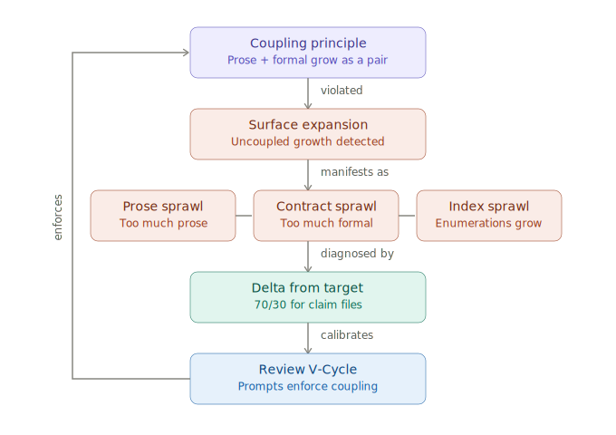

# The Coupling Principle

Prose and formal content are authored as a pair. This is the system's core quality discipline. A reasoning system converges when each new claim gets both a formal statement — the thing being claimed — and the prose that introduces it, motivates it, and (later) proves it. The two grow together, and their coupling is the discipline that distinguishes real reasoning from hand-waving or unmotivated formalism.

The coupling holds at an artifact-specific ratio. Measurement binds to the artifact being written, not to the stage label.

## Rules of thumb

> Notes hold 90/10. Claim files hold 70/30. Divergence from either is the signal.

Two artifacts, two targets, one coupling principle. These ratios are observed on Xanadu — the specific numbers may vary across domains (a different domain's formal language or proof style could produce a different equilibrium), but the underlying coupling discipline generalizes.

## Prose as generative substrate

The coupling principle is not an arbitrary quality metric. It reflects an empirical observation about how discovery works: formal notation is declarative — it states what is already known. Prose is generative — it surfaces what is not yet known. Analogies, ambiguities, partially-formed claims, "this is like that" connections, and imprecise framings all live in prose, and those imprecisions are exactly what seed the next round of questions. Strip the prose and you strip the substrate that the next questions would have grown from.

Formalism cannot generate its own next move. It can only record moves that the surrounding prose made first. Prose is the generative medium; formal notation is a precipitate that falls out of it when an idea is ready to be pinned down. This line was written from observed behavior — when the formal share of a discovery-stage note grows too large, discovery stops. No new questions surface, no new connections get proposed, no new concept-coinages appear.

### Asymmetric failure modes

This makes the prose:formal balance asymmetric in a way that matters for system design.

**Too much prose fails loudly.** The note looks reasoned but isn't anchored. Hand-waving is visible in the output — easy to flag on review, easy to correct by adding formal anchors.

**Too much formal fails silently.** The note simply stops producing new content. There is no bad output to critique; the system just stalls. The absence of generative output — no new claims, no next round of questions — masquerades as rigor. This is arguably the worse failure, because it is invisible to quality-focused review.

### Prompt design implication

Both failure directions are real, and the review/revise process has produced both — but unevenly.

**The observed operational failure is prose expansion.** In practice, review cycles inflate prose through defensive justification, meta-commentary, exhaustiveness claims, and textual fixes that add surface without adding reasoning content. This is the dynamic that produced ASN-0034's 190,940-word bloat. Review findings trigger additions; each addition becomes a new target for future findings; prose grows monotonically. This is [Surface Expansion](../equilibrium/surface-expansion.md) — the failure the current system has actually hit, repeatedly.

**The opposite failure is uncoupled formalization.** A review finding that pushes formal notation without corresponding prose growth replaces the derivation and proof content that makes the formal statement meaningful. This failure has not been the protocol's tendency — but the coupling principle predicts it would be harder to detect, because it masquerades as rigor.

**The discipline is coupling, not direction.** Review prompts must not push toward *either* surface uncoupled from the other. A revision that adds prose without a corresponding formal anchor is prose sprawl. A revision that adds formal notation without motivating prose is uncoupled formalization. The correct review finding pushes toward coupling: "this formal statement lacks motivating prose" or "this narrative section needs a formal anchor." The incorrect review finding pushes one surface in isolation: "elaborate on this explanation" (uncoupled prose growth) or "state this more formally" (uncoupled formalization).

This constraint applies to review at every scope. Review prompts for claim files must enforce coupling — not protect one surface at the expense of the other, but ensure that every revision that grows one surface grows the other, or restructures to shrink both.

## The coupling per artifact

### Notes — 90/10

A note is the working artifact during discovery: a whole document where properties are proposed, connected to source material, motivated, and first pinned down in formal notation. Each new property is born with both halves — a formal statement and the prose that introduces it — and the two grow at similar rates across revisions.

The ratio settles at **~90% prose / 10% formal** because each formal anchor needs substantial surrounding narrative. Discovery is predominantly reasoning-in-prose with formal content as anchor points.

- **Coupling signal:** prose and formal growth rates track each other
- **Convergence signal:** ratio holds AND growth rates approach zero (saturation — new questions answerable from existing content)

**Decoupling is the warning.** Prose growing without formal is hand-waving. Formal growing without prose is unmotivated formalization — and, per the asymmetry above, the more dangerous failure because it kills the generative process silently.

The [note convergence protocol](../protocols/note-convergence-protocol.md) governs review/revise cycles on notes during discovery. The 90/10 ratio is a quality boundary within that protocol — monitored but not enforced by the convergence predicate itself.

### Claim files — 70/30

A claim file is the working artifact during claim convergence: an individual claim with its contract, proof, and dependencies. Formal contracts carry axioms, preconditions, postconditions, and Depends entries. Prose carries the derivation and proof — the reasoning that *consumes* the contract.

The ratio settles at **~70% prose / 30% formal** because contracts are compact statements and proofs are discursive arguments over them. Neither can disappear without losing something essential — the contract is what's claimed; the proof is why it holds.

- **Coupling signal:** contracts and their proofs grow together, cycle by cycle
- **Convergence signal:** ratio holds across cycles; word counts stabilize; review findings don't reintroduce resolved issues

**Divergence signals Sprawl.** Too much formal (essay content invading contract or Depends slots) is [Contract Sprawl](../equilibrium/contract-sprawl.md). Too much prose (meta-commentary accreting around stable proofs) is [Prose Sprawl](../equilibrium/prose-sprawl.md). Either is [Surface Expansion](../equilibrium/surface-expansion.md) against the 70/30 target — a decoupling where one half grows without the other. The [Voice Principle](voice.md) is the discipline that contains add-bias at this stage — positive style structure constrains the reviser to load-bearing prose by construction, and the REVISE/OBSERVE classification prevents tightening findings from reaching the reviser at all.

Note that the asymmetry described above applies differently during claim convergence than during discovery. In claim convergence, the generative work is already done — the claims exist, and the task is to prove them. The prose:formal balance here is about proof quality, not about generative capacity. Both directions of divergence are genuine failures, and neither is silent in the way that premature formalization is during discovery.

## The signal: delta from target

A monitor tracks the delta from target for each active claim file.

| Artifact | Target | Divergence direction | Diagnosis |
|----------|--------|----------------------|-----------|
| Claim file | 70/30 | significantly above 70% prose | Prose Sprawl (loud failure) |
| Claim file | 70/30 | significantly below 70% prose | Contract Sprawl (silent failure) |

The delta is a single number; its sign is a diagnosis. Precise tolerance bands are not yet established — current observations (one compress pass) suggest ±2–5 points, but this should be recalibrated as more notes complete claim convergence. This monitoring binds to the [claim convergence protocol](../protocols/claim-convergence-protocol.md), which operates on claim files at whatever scope the choreography selects.

The notes 90/10 ratio is an empirical observation from discovery — it shows that coupling exists across both artifacts. The [note convergence protocol](../protocols/note-convergence-protocol.md) governs review/revise on notes; the 90/10 ratio is a quality target within that protocol's operation.

## Empirical basis

**Notes (ASN-0034 and ASN-0036).** Both held near the 90/10 target throughout their pure-discovery periods. ASN-0034 formal grew 1.76×, prose 1.49×; ratio drifted 90.3% → 88.8%. ASN-0036 formal grew 1.38×, prose 1.69×; ratio drifted 89.4% → 91.2%. Both stayed near target but drifted in opposite directions — the sample is too small to fix tight tolerance bands.

**Claim files (ASN-0034 compress pass, April 2026).** 80 claim files compressed from 190,940 → 49,843 words (73.9% reduction). Pre-compress aggregate: 43% prose / 57% formal — inflated by Contract Sprawl (essay content inside contract and Depends slots). Post-compress aggregate: 66% prose / 34% formal — close to the 70/30 target. The post-compress state matches what clean claim files look like: lean contracts plus derivation prose, coupled.

**The silent failure in practice.** The 190,940-word pre-compress state of ASN-0034 was itself a product of the asymmetric failure. Review cycles pushed formal content (contracts, dependency declarations, exhaustiveness claims) into claim files without corresponding growth in derivation prose. The formal share grew to 57% — well past the 70/30 target — and the files stopped generating new reasoning content. The compress pass that removed 73.9% of the content restored the ratio and, observably, restored the generative capacity of the claim convergence process.

## Domain variance

The 90/10 and 70/30 targets are from Xanadu's reconstruction work — a domain with mathematical-proof-style formalization over Dijkstra-notation contracts. Other domains may settle at different equilibria:

- A science domain where claims are empirical and formal content is protocol/measurement may produce a different note ratio.
- A legal domain with structured statutes as the formal layer may produce a different claim-file ratio.
- Anywhere the formal language is denser or sparser relative to the explanatory prose it supports, the target shifts.

What doesn't vary is the *coupling principle*: prose and formal content are authored as a pair, at whatever ratio the domain's formal language naturally produces. The generative asymmetry also generalizes — in any domain, the prose surface is where new questions come from, and compressing it prematurely stops the generative process. Per-domain calibration is a one-time measurement; the monitoring story and the prompt design constraint stay the same.

## Related

- [Validation Principle](validation.md) — the sibling principle for structural health across files. Coupling monitors within-file ratio; Validation checks across-file invariants mechanically before review.
- [Voice Principle](voice.md) — the sibling principle for LLM output quality. Coupling defines what healthy content looks like (the ratio). Voice defines what well-formed output looks like (the style structure). During claim convergence, Voice is the mechanism that keeps the ratio near target — positive style discipline constrains the reviser to load-bearing prose, preventing the add-bias that drives ratio drift.
- [Surface Expansion](../equilibrium/surface-expansion.md) — the failure mode this principle's signals detect. Surface expansion is a decoupling event.
- [Contract Sprawl](../equilibrium/contract-sprawl.md), [Prose Sprawl](../equilibrium/prose-sprawl.md), [Index Sprawl](../equilibrium/index-sprawl.md) — specific decoupling manifestations in claim files.
- [Architecture — Lattice Lifecycle](../architecture.md) — the three transitions (decompose, promote, assemble) define the artifact boundaries this principle operates within.
- [Narrow → Refine → Verify](../patterns/narrow-refine-verify.md) — the cycle that operates within each artifact's active period.
- [Claim Convergence Protocol](../protocols/claim-convergence-protocol.md) — the protocol whose review cycles this principle's signals monitor.
- [Note Convergence Protocol](../protocols/note-convergence-protocol.md) — the protocol governing note-level review where the 90/10 ratio applies.
- [Accretion](../patterns/accretion.md) — the healthy growth discipline that keeps prose and formal coupled.