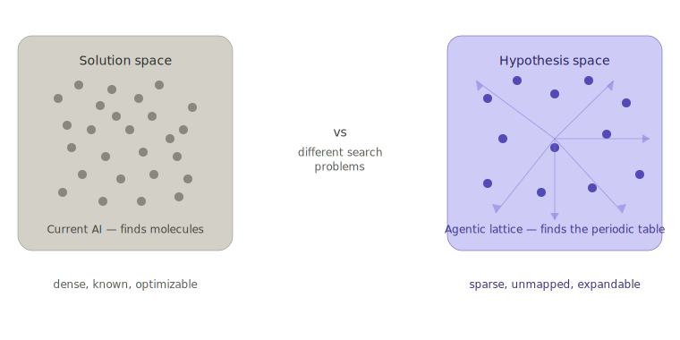
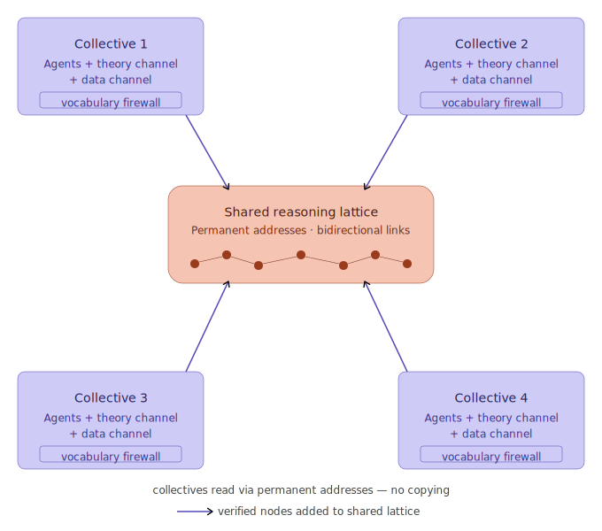

# Vision

The reasoning lattice is properties connected by links, shared through transclusion, and versioned for concurrent access. Three Xanadu protocol primitives make this possible:

**Links** — every dependency between properties is a bidirectional link. The lattice IS the link structure.

**Transclusion** — properties reference each other's content directly. One source of truth, many views. No copying, no assembly.

**Versioning** — every property has a permanent version history. Agents work against stable snapshots while the lattice evolves around them.

Together they provide:

- Addressable knowledge — every property, every claim, every proof step has a permanent address
- Traceable provenance — any conclusion can be traced back through its dependency links
- Shared reasoning — agents work from the same properties, not copies that drift
- Concurrent access — multiple agents work the lattice simultaneously, each seeing a consistent versioned view
- Live dependencies — when a foundation property is updated, consumers see the update through transclusion
- No conflicts — versioned snapshots mean agents never interfere with each other's work
- Growth without coordination — new properties link into the lattice without central planning
- Focused reasoning — links and transclusion let agents narrow to any cluster of properties directly, without assembling files or breaking documents apart. Blueprinting and formalization are no longer separate stages — they are reasoning at different scopes on the same linked structure

## The protocol as discovery engine

The lattice is not a knowledge store — it is an active hypothesis discovery engine. Current AI systems navigate solution space efficiently: given a target, find something that satisfies it. The lattice navigates hypothesis space: given a domain, discover the principles that organize it.

The mechanism: a human-posed inquiry is decomposed into channel-appropriate sub-questions. Independent channels explore hypothesis space and evidence space separately, enforced by the vocabulary firewall. The synthesis agent joins their outputs into a new lattice node. Where the channels agree, principles are validated. Where they disagree, new hypotheses emerge.

Out-of-scope findings flagged during review become candidates for [new inquiries](patterns/scope-promotion.md). Each new inquiry decomposes, explores, and synthesizes — attaching to the lattice as a new node with links to what spawned it. The lattice discovers the questions it should be asking, not just answers to questions posed. The protocol substrate — permanent addresses, bidirectional links, transclusion — makes every hypothesis immediately addressable and buildable-upon by every other agent in the collective.

This is what current agentic platforms cannot do. They find molecules. The lattice finds the periodic table.

## Semantic communication substrate

The three Xanadu primitives map directly onto the semantic communication requirements for distributed agentic intelligence:

**Links** are the routing structure — agents navigate to exactly the knowledge they need without assembly or search.

**Transclusion** is the content-sharing mechanism — agents reference each other's verified reasoning directly, without copying. One source of truth means no drift, no contradiction, no hallucination from stale copies.

**Versioning** is the concurrency protocol — agents work against stable snapshots while the lattice evolves. No conflicts. No coordination overhead. Growth without central planning.

Together they constitute a formally verified semantic communication substrate — the shared long-term memory that agents coordinate through, grown autonomously rather than hand-curated. This is the substrate that moves agentic communication beyond Shannon information (syntactic) toward semantic communication and communication effectiveness.

## Agentic evolution through the lattice

The versioned lattice is the fine-tuning curriculum. Every campaign's reasoning history is permanently addressable — every review cycle, every finding, every revision is a lattice node with full provenance. Agents evolve by reading their own trails, not by optimizing end-to-end performance signals.

This is Lamarckian evolution: acquired reasoning is directly transmissible. An agent that discovers a new principle through structured disagreement encodes that principle as a verified lattice node. Subsequent agents build on it through transclusion — the discovery propagates through the collective without retraining from scratch.

The adiabatic V-cycle governs how evolution happens: each scale converges before the next begins. Property-level refinement converges. Cluster-level refinement converges. System-level review converges. Evolution is gradual and controlled — not simultaneous multi-objective optimization, but structured incremental improvement through the same rhythm that built the lattice.

Phase II agents don't just use the lattice. They grow it, read it, and evolve through it. The protocol substrate is both the communication medium and the evolutionary record.

## Building the engine

What exists today is the local implementation: agents running structured pipelines on a single machine, producing a verified dependency lattice through discovery, blueprinting, formalization, and modeling. The Xanadu protocol substrate — currently implemented as files, git commits, and YAML dependencies — will be rebuilt as a live linked structure.

When the substrate is live:
- Every property has a permanent address, not a file path
- Every dependency is a bidirectional link, not a YAML field
- Every version is a permanent snapshot, not a git commit
- Blueprinting and formalization are reasoning at different scopes on the same linked structure, not separate pipeline stages

The engine scales what works locally into something that works distributedly. Distributed agents trace reasoning trails through permanent links, share verified principles through transclusion, and work concurrently through versioned snapshots — without coordination, without copying, without conflict.

This is the infrastructure that makes distributed hypothesis discovery tractable. The lattice grows deeper, broader, and more connected — autonomously, through operation.